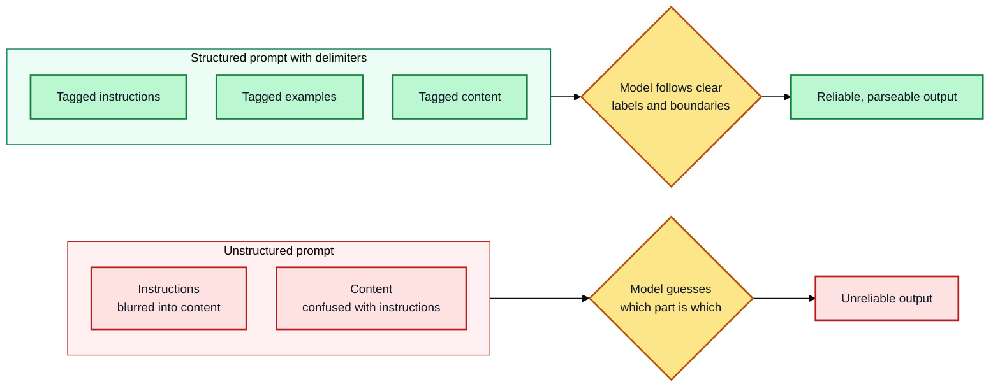

# Module 3: Clarity, Structure & Few-Shot

**Estimated time: 25-30 min** | **Prerequisite: Module 2**

By now you know that vague prompts fail because the AI has to guess. This lesson covers the next problem: even a detailed prompt can confuse the model if it can't tell where your instructions end and your examples or data begin. That's what structure fixes.

---

## 3.1 Why Structure Matters

Once a prompt has more than one part — instructions, background text, examples, a question — the model has to figure out which part is which. Without clear boundaries, it can blur them together: treating a line of your instructions as part of the text to summarize, or mixing your example into the actual answer.

Structure — delimiters and tags — solves this by marking boundaries explicitly, so parsing isn't left to guesswork.



---

## 3.2 Simple Delimiters

The easiest way to separate a prompt's parts is with a visual marker. Common options:

- Triple quotes: `""" TEXT """`
- Triple dashes: `--- TEXT ---`
- Angle brackets: `< TEXT >`

**Example:**
```
Summarize the text delimited by triple quotes in one sentence.

"""
Delimiters are essential for structuring prompts so the model
can tell instructions apart from the content it's working on.
"""
```

This is usually enough for short, single-purpose prompts — one instruction, one block of text.

---

## 3.3 XML Tags (for More Complex Prompts)

When a prompt has several distinct parts — instructions, context, multiple examples, a specific question — XML-style tags are more reliable than plain delimiters, because each tag names what it contains instead of just marking a boundary.

**Example:**
```
<instructions>
Classify the sentiment of the review below as Positive, Negative, or Neutral.
</instructions>

<examples>
<example>Review: "Loved it!" → Positive</example>
<example>Review: "Terrible service." → Negative</example>
</examples>

<review>
The food was fine but the wait was way too long.
</review>
```

**Practical tips:**
- Use a closing tag that matches the opening tag (`<examples>...</examples>`)
- Keep tag names descriptive (`<context>`, `<examples>`, `<question>`) rather than generic (`<a>`, `<b>`)
- You can also use tags to control the output — e.g., asking the model to put its final answer inside `<answer>` tags, making it easy to extract programmatically

---

## 3.4 When You Don't Need Structure

Structure isn't free — it adds tokens and visual overhead. For a short, single-instruction prompt with no examples or extra context, plain sentences usually work just as well as tagged XML; there's nothing for the model to get confused about in the first place. Reach for structure when a prompt has multiple distinct parts to keep separate — not by default on every prompt.

---

## 3.5 Designing Good Few-Shot Examples

You covered what few-shot prompting is in Module 2. This section covers how to make your examples actually work:

- **Use 3-5 examples where possible** — enough for the model to see the pattern, not so many that the prompt becomes unwieldy
- **Keep examples diverse** — If every example shares a trait unrelated to what you're testing (e.g., all your positive reviews happen to be long), the model may learn the wrong pattern
- **Wrap each example clearly** — especially once you have more than one — `<example>...</example>` tags prevent the model from blending one example into the next
- **Match the format you want back** — The model tends to mirror the structure of your examples closely, so if your examples are messy, expect a messy answer

---

## 3.6 Structure + Examples Together

These techniques stack. A well-built prompt often combines role, context, tagged examples, and a clearly marked question all in one — each piece easy for the model (and for you, re-reading it later) to tell apart.

**Full example:**
```
<role>You are a customer support ticket classifier</role>

<context>
Tickets come in via email and need to be routed to the right team.
</context>

<instructions>
Classify each ticket into: Technical, Billing, or General
Output the category only, no explanation.
</instructions>

<examples>
<example>Ticket: "WiFi keeps dropping" → Technical</example>
<example>Ticket: "I was charged twice" → Billing</example>
<example>Ticket: "What are your hours?" → General</example>
<example>Ticket: "App crashes on startup" → Technical</example>
<example>Ticket: "Need refund for overcharge" → Billing</example>
</examples>

<ticket>
{{TICKET_HERE}}
</ticket>

<answer>
```

---

## 3.7 Markdown Formatting & Structural Ordering

### Markdown as structure

Models are trained on enormous amounts of Markdown, so simple Markdown scaffolding often works as well as XML tags — headings, bold labels, lists, and code-fenced blocks act as weak delimiters. A good rule of thumb:

- **Short, simple prompts** → Markdown headings or bold labels (`**Instructions:**`) — minimal overhead
- **Longer, multi-part prompts** → XML-style tags; they're more explicit about boundaries
- **Don't blend styles mid-prompt** — pick one convention and stay consistent throughout

### Structural ordering for long prompts

For a prompt with many parts, a consistent order reduces confusion (for the model, and for whoever maintains the prompt later):

1. **System/role** instructions (persistent behavior) first
2. **Context** the model needs (what's happening, prior state, real-world constraints)
3. **The instructions** — the actual task, stated clearly
4. **Few-shot examples** (if any), each demonstrating the pattern
5. **The specific input/question** — last, so it's nearest the model's generation window

The broad principle: *how you want the model to behave comes earliest; what it should act on comes last.*

---

## Key Takeaways

1. **Structure prevents confusion** — Model needs to know where instructions end and data begins
2. **Simple delimiters work for simple prompts** — `"""`, `---`, or `< >`
3. **XML tags work for complex prompts** — Named tags are more reliable
4. **Markdown works for short prompts** — Headings/bold labels are valid structure too
5. **Don't over-structure** — Short prompts don't need tags
6. **Order long prompts consistently** — behavior first, specific input last
7. **Diverse examples beat many similar ones** — Quality over quantity
8. **Match your example format to desired output** — Model mirrors your structure
