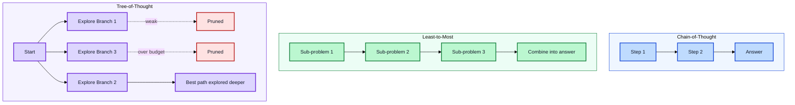
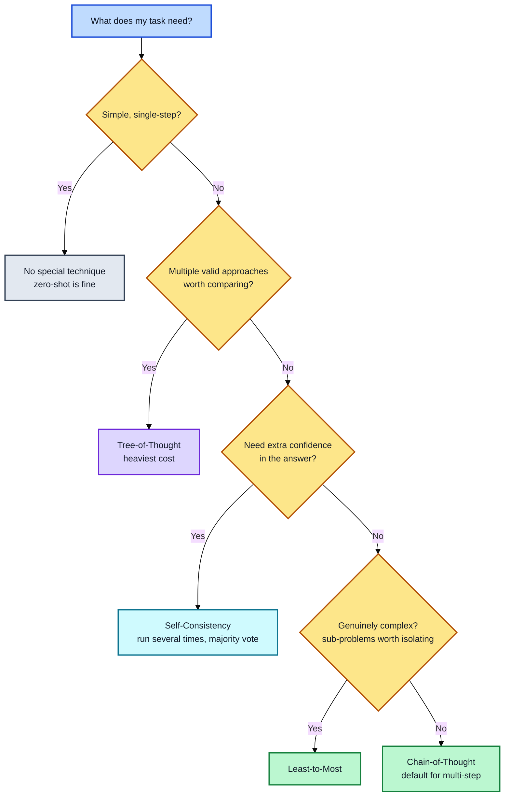

# Module 4: Reasoning Techniques

**Estimated time: 30-35 min** | **Prerequisite: Module 2**

Module 2 introduced Chain-of-Thought briefly. This module goes deeper into reasoning techniques specifically — including two more powerful (and more expensive) options, and how to decide when the extra cost is actually worth it.

---

## 4.1 Chain-of-Thought (CoT), Revisited

Asking the model to reason step by step before answering, instead of jumping straight to a conclusion. This works because the model generates its answer one piece at a time — if it reasons through the problem first, its final answer is grounded in that reasoning rather than a first guess.

**Simple trigger phrases:**
- "Let's think step by step."
- "Let's work through this carefully, one step at a time."
- "Before answering, list out each relevant factor."

**Example:**
```
A store had 120 apples. It sold 45 and received a delivery of 30 more.
How many apples now? Let's think step by step.
```

**Output:**
```
Step 1: Start with 120 apples
Step 2: Sold 45 → 120 - 45 = 75 apples
Step 3: Received 30 more → 75 + 30 = 105 apples

Answer: 105 apples
```

CoT typically costs more tokens (2-4x a direct answer) because you're generating visible reasoning text, not just a final answer — a fair tradeoff on anything with real multi-step logic, but often unnecessary on simple lookups.

---

## 4.2 Self-Consistency

Instead of trusting one reasoning attempt, you run the same Chain-of-Thought prompt several times (typically 5-10) and take whichever final answer comes up most often. The idea: an individual reasoning path can go wrong in a random way, but if most independent attempts agree, that answer is more trustworthy.

**How it works:**
```
Prompt: "Is 17 a prime number? Think step by step."

Run 1: "17 is prime because..." → Yes
Run 2: "17 is only divisible by 1 and 17..." → Yes
Run 3: "Testing divisibility: not divisible by 2, 3, 5..." → Yes

Consensus: Yes (3/3 agree)
```

**When to use it:** high-stakes situations where being right matters more than being fast or cheap — financial calculations, medical-adjacent recommendations, legal analysis. Not a good fit for routine or high-volume tasks, since it multiplies your token cost by however many times you run it.

**Its real limitation:** self-consistency doesn't help if the model is wrong for the same reason on every attempt — majority voting only helps when errors are random and independent, not systematic.

---

## 4.3 Tree-of-Thought (ToT)

Instead of one linear reasoning chain, the model branches into multiple possible next steps, evaluates which ones look promising, and explores the strongest branches further — dropping the weaker ones along the way. Think of CoT as reasoning in a straight line, and ToT as reasoning in a tree that prunes its own weak branches.

**Example:**
```
Task: Plan a 3-day trip to Tokyo with a $2000 budget.

Thought Branch 1:
  → Day 1: Shinjuku, Day 2: Shibuya, Day 3: Asakusa
  → Budget: $1800 ✓
  → Pros: Balanced mix of areas
  → Cons: Lots of travel between areas

Thought Branch 2:
  → Day 1: Shibuya, Day 2: Shibuya, Day 3: Shibuya
  → Budget: $1200 ✓
  → Pros: Less travel, deeper exploration
  → Cons: Misses other areas

Thought Branch 3:
  → Day 1: Disney Sea, Day 2: Akihabara, Day 3: Kyoto day trip
  → Budget: $2200 ✗ (over budget)
  → Pros: Diverse experiences
  → Cons: Over budget, too ambitious

Best path: Branch 1 (balanced, within budget)
```

**When to use it:** problems where there are genuinely multiple valid approaches worth comparing — puzzles, strategic planning, creative or open-ended design work — not problems with one clear correct method.

**The real cost:** ToT is the most expensive technique in this lesson, sometimes requiring dozens of model calls for a single problem. Research testing it on puzzle-solving found it could take 10-50x the tokens of a direct answer. Reserve it for cases where thoroughness clearly matters more than speed or cost.

---

## 4.4 Least-to-Most Prompting

A simpler, cheaper alternative worth knowing: break a complex problem into a sequence of smaller sub-problems, and have the model solve them in order, using each answer to inform the next. This avoids the branching cost of Tree-of-Thought while still handling multi-part problems more reliably than a single CoT pass.

**Example approach:**
```
First, break this problem into smaller steps.
Then solve each step in order, using the previous answer where needed.
Finally, combine the steps into the full answer.
```

**Full example:**
```
Problem: A farmer has 3 fields. Field A produces 2x the apples of Field B.
Field C produces 10 fewer than Field A. If Field B produces 40 apples,
how many apples does the farmer have total?

Step 1: Break into sub-problems
  - Find Field B (given = 40)
  - Find Field A (2x Field B)
  - Find Field C (Field A - 10)
  - Sum all three

Step 2: Solve in order
  - Field B = 40
  - Field A = 2 × 40 = 80
  - Field C = 80 - 10 = 70

Step 3: Combine
  - Total = 40 + 80 + 70 = 190 apples
```



---

## 4.5 Verification Prompting (Self-Verification)

The reasoning techniques above make the model *produce* an answer. Verification prompting adds a second step: make the model *critique its own draft* before finalizing.

**Why it differs from self-consistency:** self-consistency (4.2) filters *random* errors by taking a majority vote across independent runs. Verification targets *systematic* errors — biases, skipped constraints, uncritical assumptions — that would survive a vote because every run makes the same mistake.

```
Step 1 (draft): Generate an answer as normal.
Step 2 (verify): Before answering, explain why this draft is correct.
Step 3 (critique): Then identify any errors, gaps, or unverified claims.
Step 4 (finalize): Produce the corrected final answer, or repair the draft
                 to address the critique.
```

**Example:**
```
Task: Write a 3-sentence summary of this article, with no plot spoilers.
Draft candidate response: ... (model writes its attempt)
Verification prompt:
  Critique this draft before finalizing:
  1. Is it exactly 3 sentences? If not, note the violation.
  2. Does it contain any plot spoilers? Quote the offending sentence.
  3. Does it capture the article's main point?
  Then produce the corrected, final 3-sentence summary.
```

Implementations vary by model: some expose an explicit checkchain or revision mode, others just respond to the extra verification instructions in the prompt. Even a cheap "check your own work" instruction catches a meaningful share of constraint violations (like length) that a single pass silently misses.

**When to use it:** constraint-heavy outputs (length, tone, format), critical single requests where you want a checked answer but self-consistency's multiple runs cost too much, and as a poor-man's structured-output check when you can't use API schema enforcement.

---

## 4.6 Choosing a Reasoning Technique



A simple way to decide, roughly in order of increasing cost:

| Situation | Technique | Cost |
|-----------|-----------|------|
| Simple, single-step question? | No special technique (zero-shot is fine) | $ |
| Multi-step but fairly linear? | Chain-of-Thought | $$ |
| Multi-step and genuinely complex? | Least-to-most prompting | $$ |
| High-stakes, need confidence in the answer? | Self-consistency | $$$ |
| Multiple valid approaches worth comparing? | Tree-of-Thought | $$$$ |

The common mistake is reaching for the most powerful (and expensive) technique by default. Match the technique to how much the task actually needs — most everyday tasks only need plain CoT, if that.

**When reasoning backfires:** none of these techniques help if the model's underlying knowledge is wrong. Reasoning can even *entrench* a mistake — the model builds a convincing-sounding chain around a false premise, and looks more confident while being just as wrong. CoT-style techniques are buying accuracy on multi-step tasks with known-correct facts; they don't fix hallucination on facts the model never knew. For facts, that's what retrieval (Module 2) and verification (Module 9) are for.

---

## Key Takeaways

1. **CoT grounds answers in reasoning** — Step-by-step beats first-guess
2. **Self-consistency buys confidence** — Majority voting filters random errors
3. **Tree-of-Thought explores alternatives** — Best for open-ended problems
4. **Least-to-most is the cheap middle ground** — Breaks problems down without branching
5. **Cost scales with power** — Match technique to task complexity
6. **Don't default to the most expensive** — Most tasks need only plain CoT
7. **Verify before finalizing** — A self-critique pass catches skipped constraints and one-sided answers
