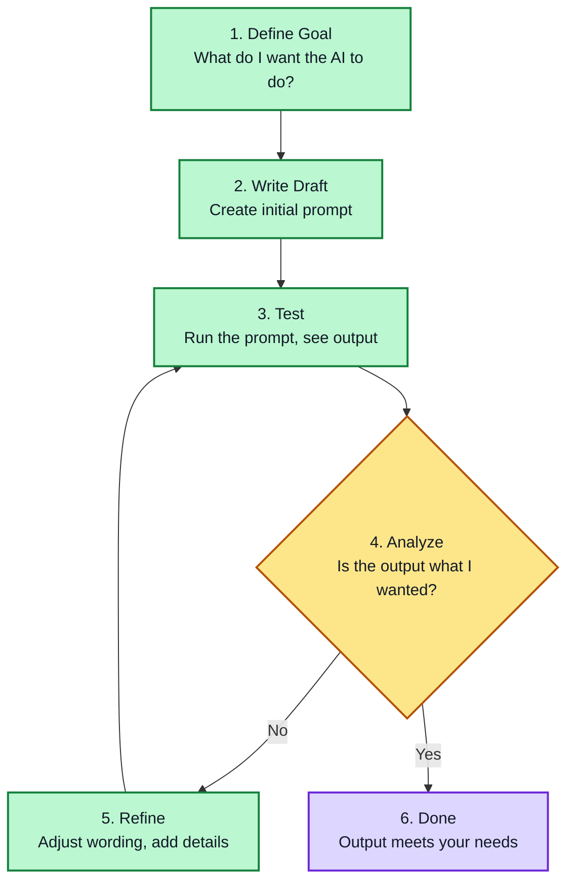
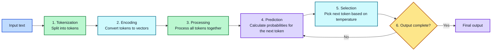

# Module 1: Foundations

## What is Prompt Engineering?

**Prompt Engineering** is the practice of designing and refining inputs (prompts) to get desired outputs from Large Language Models. It's the skill of communicating effectively with AI.

### Why Prompt Engineering Matters

| Bad Prompt | Good Prompt | Result Difference |
|------------|-------------|-------------------|
| "Write about dogs" | "Write a 300-word article about health benefits of dog ownership for first-time pet owners" | Generic vs. targeted content |
| "Fix this code" | "Fix this Python function that throws TypeError when input is None" | Vague vs. actionable fix |
| "Translate this" | "Translate this Spanish sentence to formal English, preserving the polite tone" | Inaccurate vs. accurate translation |

### Who Uses Prompt Engineering?

- **Writers**: Generate articles, scripts, marketing copy
- **Developers**: Write, debug, and document code
- **Researchers**: Analyze data, summarize papers
- **Business Professionals**: Draft emails, proposals, reports
- **Students**: Learn concepts, get explanations
- **Anyone using AI tools**: Get better results from ChatGPT, Claude, Gemini, etc.

### Core Principles

1. **Clarity** – Say exactly what you mean
2. **Specificity** – Add details (audience, format, length, tone)
3. **Context** – Give background information
4. **Examples** – Show what you want
5. **Iteration** – Refine based on results

### Prompt Engineering vs. Programming

| Aspect | Programming | Prompt Engineering |
|--------|-------------|-------------------|
| Language | Strict syntax (Python, JS) | Natural language (English, etc.) |
| Errors | Syntax errors, crashes | Unexpected or vague outputs |
| Precision | Exact control | Probabilistic outcomes |
| Debugging | Fix code logic | Refine prompt wording |
| Learning curve | Steep (months/years) | Gentler (hours/days) |

### The Prompt Engineering Workflow



---

## How LLMs Process Prompts

### What is a Large Language Model (LLM)?
A Large Language Model is an AI system trained on massive amounts of text data. It predicts the next token (piece of text) based on what came before. Think of it like an extremely advanced autocomplete.

**Key insight**: LLMs don't "think" like humans. They generate text by predicting statistically likely continuations based on patterns in training data.

---

### Tokenization

**What are tokens?**
Tokens are the basic units LLMs process. A token is NOT the same as a word.

| Text | Tokens |
|------|--------|
| "Hello world" | 2 tokens |
| "artificial intelligence" | 4 tokens |
| "don't" | 2 tokens ("do" + "n't") |
| "unbelievable" | 3 tokens ("un" + "believ" + "able") |

**Why does this matter?**
- LLMs have token limits (context window)
- Long prompts use more tokens
- Code and unusual words often use more tokens than expected
- You pay per token in API usage

**Tokenization rules:**
- Common words = 1 token
- Rare words = multiple tokens
- Numbers vary (123 might be 1-2 tokens)
- Punctuation counts as tokens
- Whitespace counts as tokens

**Try it — estimate token cost:**
1. Write a ~200-word paragraph on any topic.
2. Guess how many tokens it is, then count exactly with a tokenizer (your model provider's docs/tool, or `tiktoken` for OpenAI-style counts).
3. Repeat with a short code snippet of similar length. Note how code and unusual words typically cost more tokens than everyday prose.

---

### Context Window

**Definition**: The maximum number of tokens an LLM can process in a single interaction (input + output combined).

**Common context window sizes ([verify current figures at your provider's docs](https://platform.openai.com/docs)):**
| Model family (2026) | Context Window |
|-------|----------------|
| GPT-4o / GPT-4.1 class | 128,000 - 1,000,000 tokens |
| GPT-5.x / o-series | 400,000 - 1,000,000 tokens |
| Claude 4.x (Opus / Sonnet) | 200,000 - 1,000,000 tokens |
| Gemini 2.5 / 3.x | 1,000,000 - 2,000,000 tokens |

**Important caveat:** an advertised window is not a guarantee of full usable quality. Benchmarking shows models typically use only about 50-65% of their advertised context effectively — beyond that, accuracy on details in the middle of the prompt drops off. A huge window doesn't mean you should fill it; it usually means you *can*, at extra cost.

**What happens when you exceed the context window?**
- The model truncates (cuts off) earlier text
- It "forgets" earlier parts of the conversation
- Output quality may degrade

**Best practices for context window management:**
1. Keep prompts concise but complete
2. Put important instructions early
3. Remove unnecessary examples when context is tight
4. Use summaries for long documents
5. Track token usage in production apps

---

### Instruction-Following

**How LLMs interpret instructions:**
LLMs follow patterns from training. They respond better to certain instruction styles.

**Strong instruction verbs:**
- "Explain..." → Detailed explanation
- "List..." → Bulleted/numbered items
- "Compare..." → Side-by-side analysis
- "Write..." → Generated content
- "Summarize..." → Condensed version
- "Fix..." → Corrected version
- "Translate..." → Language conversion

**Weak instruction verbs (avoid):**
- "Write something about..." → Vague output
- "Tell me about..." → Generic response
- "Help me with..." → Unclear expectations

**Instruction placement matters:**
```
# BAD - Instruction buried
Here's some context about the project. The team has been working on it for months. 
The deadline is next week. We need to present to stakeholders. Oh, can you write 
a summary of the project status?

# GOOD - Instruction first
Write a 200-word project status summary for stakeholders.

Context: The project has been in development for 3 months with a deadline next week.
Key milestones: Design complete, 70% development done, testing begins Monday.
Risks: Two developers may be reassigned to another project.
```

---

### System Prompts vs. User Prompts

**System prompt**: Sets the AI's behavior, role, and constraints. Acts as persistent instructions.

**User prompt**: The specific request or task.

```
SYSTEM: You are a professional financial advisor. Always include disclaimers.
        Never give specific stock recommendations. Be conservative in advice.

USER: Should I invest in cryptocurrency?
```

**Why separate them?**
- System prompt sets consistent behavior across all interactions
- User prompt changes per request
- System prompt can enforce rules (tone, format, restrictions)

**System prompt examples:**
```
# Casual assistant
You are a friendly, casual assistant. Use simple language and humor when appropriate.

# Professional writer
You are a professional technical writer. Use formal tone, clear structure, 
and avoid jargon. Always include examples.

# Code helper
You are an expert programmer. Explain code line-by-line. 
Always suggest improvements and mention edge cases.
```

---

### Temperature and Creativity

**Temperature** controls randomness in responses (0.0 to 2.0).

| Temperature | Behavior | Best For |
|-------------|----------|----------|
| 0.0 | Highly repeatable (near-identical, not byte-guaranteed) | Code, factual answers, consistent formatting |
| 0.3 | Mostly predictable, slight variation | Summaries, explanations |
| 0.7 | Balanced creativity and coherence | General writing, brainstorming |
| 1.0 | Creative, varied outputs | Creative writing, diverse ideas |
| 2.0 | Very random, may be incoherent | Experimental, rarely used |

**Practical examples:**

```python
# Code generation - use low temperature
temperature=0.0  # Same code every time, reliable

# Blog post - use medium temperature  
temperature=0.7  # Creative but coherent

# Poetry - use high temperature
temperature=1.0  # More creative variation
```

**Note**: Not all platforms expose temperature. Some use "creativity" sliders.

**Note**: Temperature is a sampling control, not a correctness dial. Even at 0.0 the model is not guaranteed to produce byte-identical output across runs or model versions (Module 7 covers this in depth); the *quality of the prompt* is what actually determines whether the answer is right.

---

### How LLMs Generate Text

**Step-by-step process:**

1. **Tokenization**: Your input is split into tokens
2. **Encoding**: Tokens are converted to numbers (vectors)
3. **Processing**: The model processes all tokens together
4. **Prediction**: It calculates probabilities for next token
5. **Selection**: Next token is selected (based on temperature)
6. **Repeat**: Steps 4-5 continue until output is complete



**Example:**
```
Input: "The capital of France is"

Token probabilities for next token:
- "Paris" → 92%
- "Lyon" → 3%
- "a" → 2%
- "the" → 1%
- Other → 2%

With temperature=0.0 → "Paris" (92%)
With temperature=1.0 → Likely "Paris" but could vary
```

**Key implications:**
- First tokens heavily influence later tokens
- Good beginning = better output
- Repetition can occur if model gets stuck in loops
- Long outputs may lose coherence

---

### Multimodal Prompts (Text + Image / Audio / Video)

Many modern models accept more than text. Your prompt can include images (screenshots, diagrams, photos), audio (voice notes, call segments), and sometimes video or long documents — alongside your instructions. The same principles apply, with extra care:

| Modality | What it enables | Extra care needed |
|----------|-----------------|-------------------|
| Image | "Fix the error in this screenshot", "describe this chart" | The model reads pixels, not text — make sure the image is legible and relevant |
| Audio | Transcribing and analyzing a call or meeting | Speech-to-text quality shapes the result; verify transcripts |
| Video / PDF / document | Answering questions about long or multimodal files | Large files consume lots of context — chunk or summarize (see Context Window) |

**Tips for multimodal prompts:**
1. **State what you want the model to do with the content** — "This screenshot shows a Python error on line 15. Fix it" beats just pasting the screenshot.
2. **Reference specific regions** — "the header chart", "the red error banner" — to focus the model's attention.
3. **Keep the task in text** — the image/content carries data, the text carries the instruction.
4. **Watch token cost** — images and long files are token-expensive; crop, compress, and trim where you can.

---

### Prompt Engineering Principles

**1. Be Specific**
```
❌ "Write about dogs"
✅ "Write a 300-word article about the health benefits of owning a dog, 
    targeting first-time pet owners, in a friendly and encouraging tone"
```

**2. Provide Context**
```
❌ "Fix this error"
✅ "I'm getting 'TypeError: cannot read property of undefined' in my React 
    component when the API call fails. Here's the code: [code]. The error 
    happens on line 15."
```

**3. Use Examples (Few-shot learning)**
```
❌ "Classify sentiment"
✅ "Classify the sentiment of these reviews as positive, negative, or neutral:
    
    'Great product, highly recommend!' → Positive
    'Terrible experience, waste of money' → Negative
    'It works okay, nothing special' → Neutral
    
    'The delivery was late but the product is good' → ?"
```

**4. Set Constraints**
```
❌ "Write a story"
✅ "Write a 500-word sci-fi short story about a robot learning to feel emotions. 
    First-person perspective. Include dialogue. End with an open question."
```

**5. Use Structure**
```
❌ "Compare Python and JavaScript"

✅ "Compare Python and JavaScript for web development.

    Cover these aspects:
    1. Learning curve
    2. Performance
    3. Ecosystem
    4. Use cases
    
    Format: Side-by-side comparison table followed by 3-sentence summary.
    Audience: Beginner developer choosing their first language."
```

---

### The Importance of First Words

**What you put first matters most.** LLMs give more weight to earlier tokens.

```
# BAD - Context first, question last
"The weather has been nice lately. The flowers are blooming. 
Birds are singing. What's 2+2?"

# GOOD - Question first
"What's 2+2? (Context: I'm helping my child with math homework)"
```

**Why?**
- Early tokens influence the "direction" of generation
- Model may forget later instructions if context is long
- The model's "attention" is distributed, but start matters more

---

### Common LLM Behaviors to Understand

**Hallucination**: LLMs can generate plausible-sounding but false information.
- Always verify facts from LLMs
- Ask for sources when accuracy matters
- Use "I don't know" as a valid response in system prompts

**Verbosity**: LLMs tend to be wordy.
- Explicitly request concise outputs
- Set word/character limits
- Use "in 3 sentences" or "in 50 words"

**Sycophancy**: LLMs often agree with users even when wrong.
- Ask for counterarguments
- Request honest feedback in system prompts
- Challenge the model: "What are the flaws in my reasoning?"

**Format inconsistency**: LLMs may not follow formatting perfectly.
- Provide explicit format examples
- Use templates with placeholders
- Verify output format before using in production

---

## Prompt Structure Template

```
[TASK]: [Clear description of what you want]

[CONTEXT]: [Background information, if needed]

[AUDIENCE]: [Who this is for]

[FORMAT]: [Desired output format - paragraph, list, table, code, etc.]

[CONSTRAINTS]: [Length, tone, style, restrictions]

[EXAMPLES]: [If applicable, show what you want]
```

**Example using the template:**
```
[TASK]: Write a product description for wireless noise-canceling headphones

[CONTEXT]: New product launch, targeting music enthusiasts and remote workers

[AUDIENCE]: Tech-savvy adults aged 25-45 who value audio quality

[FORMAT]: 150-word product description with 3 bullet-point feature highlights

[CONSTRAINTS]: Professional tone, avoid technical jargon, emphasize comfort 
and sound quality

[EXAMPLES]: 
"Crystal-clear audio meets all-day comfort. These headphones block out 
the world so you can focus on what matters."
```

---

## Common Pitfalls

| Pitfall | Why It Fails | How to Fix |
|---------|--------------|------------|
| **Vague Prompts** | Model guesses what you want | Add specificity: who, what, when, where, why |
| **Conflicting Instructions** | Model can't satisfy both | Choose one priority, remove contradictions |
| **Missing Context** | Model makes wrong assumptions | Provide background, examples, constraints |
| **Over-constraining** | Too many rules, output suffers | Focus on 3-5 key constraints max |
| **No examples** | Model doesn't know your style | Include 1-3 examples of desired output |
| **Buried instructions** | Model misses key requirements | Put important instructions first or last |
| **Assuming knowledge** | Model doesn't know your context | State everything explicitly |

---

## Checklist Before Writing a Prompt

- [ ] **Task**: Is the goal crystal clear?
- [ ] **Audience**: Who is this for?
- [ ] **Format**: What should the output look like?
- [ ] **Length**: How long should it be?
- [ ] **Tone**: Formal? Casual? Technical?
- [ ] **Context**: Does the model need background info?
- [ ] **Examples**: Can I show what I want?
- [ ] **Constraints**: Any restrictions or requirements?
- [ ] **Priority**: What matters most if I can't have everything?

---

## Quick Formulas

**For Explanations:**
```
Explain [CONCEPT] to someone with [KNOWLEDGE_LEVEL] knowledge. 
Use [EXAMPLES] and avoid [TERMS]. 
Keep it [LENGTH] and focus on [KEY_ASPECTS].
```

**For Summaries:**
```
Summarize [CONTENT] in [LENGTH] for [AUDIENCE]. 
Highlight [KEY_POINTS]. 
Use [TONE] tone.
```

**For Comparisons:**
```
Compare [ITEM1] and [ITEM2] focusing on [ASPECTS]. 
Provide [EXAMPLES] and a [CONCLUSION_TYPE] conclusion.
Format: [TABLE/PARAGRAPHS/BULLET_POINTS].
```

**For Creative Content:**
```
Write a [FORMAT] about [TOPIC] with [THEME/TONE]. 
Include [ELEMENTS] and [CONSTRAINTS]. 
Target audience: [AUDIENCE].
```

**For Code:**
```
Write [LANGUAGE] code that [FUNCTION]. 
Use [LIBRARIES/Frameworks] if needed.
Include [COMMENTS/DOCUMENTATION].
Handle edge cases: [LIST_CASES].
```

---

## Key Takeaways

1. **Tokens ≠ Words**: Be aware of tokenization for context management
2. **Context is Limited**: Plan what goes into your prompt carefully
3. **Specificity Wins**: Detailed prompts produce better outputs
4. **Structure Matters**: Organized prompts are easier for models to follow
5. **First Words Matter**: Put important instructions early
6. **Verify Outputs**: LLMs can hallucinate; always check critical information
7. **Iterate**: Prompt engineering is iterative - refine based on results
