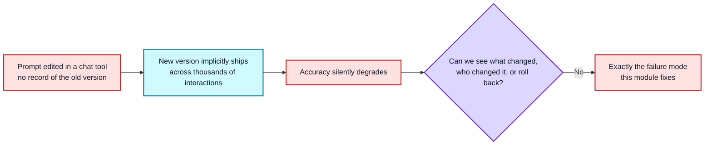
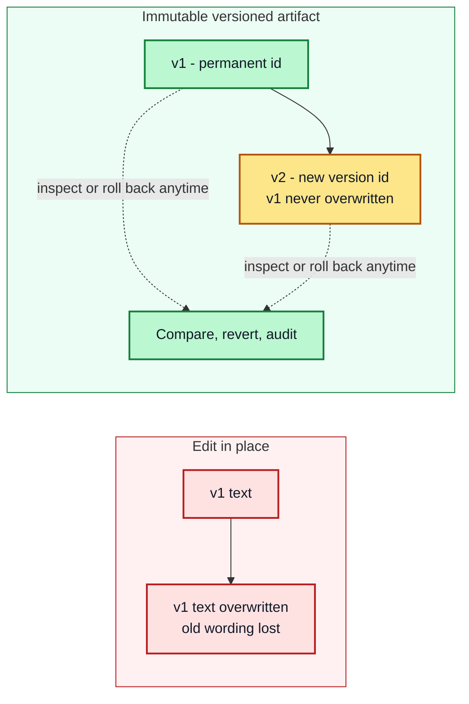
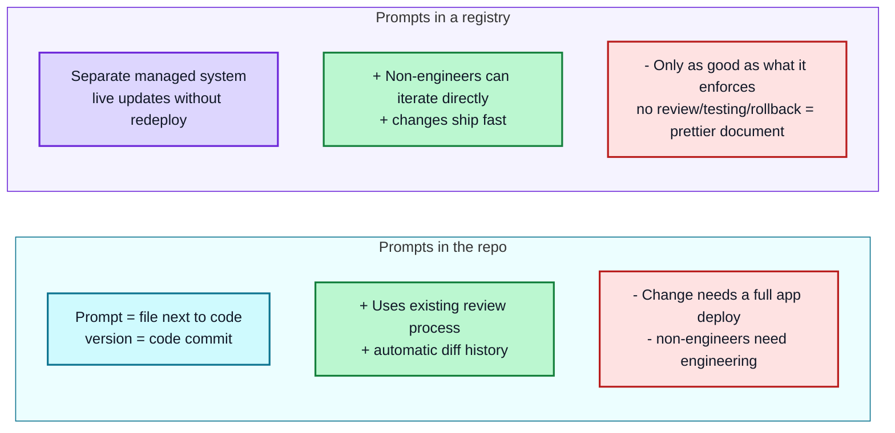
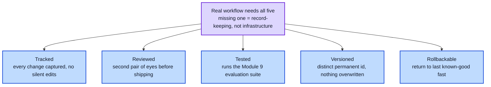
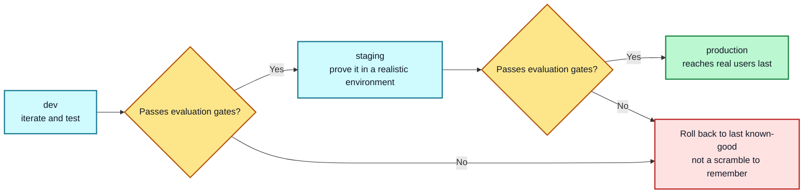
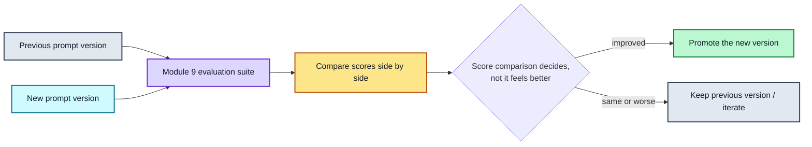
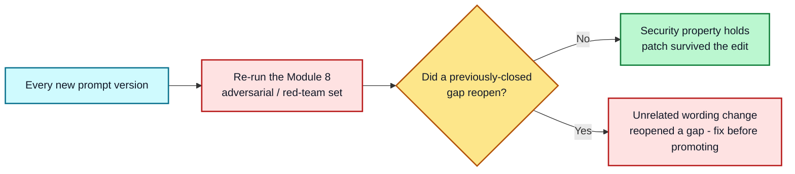
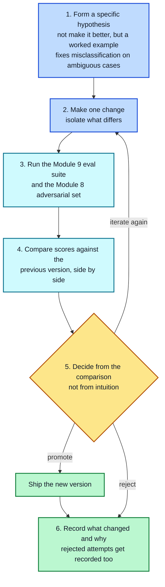

# Module 10: Iteration Workflow

**Lesson | Estimated time: 40-45 min** | **Prerequisite: Modules 8 and 9**

This module ties everything together. Modules 1-7 gave you techniques; Module 8 gave you security; Module 9 gave you evaluation. None of that matters if changes to a prompt happen ad hoc — edited in place, untracked, with no way to tell what changed or roll back when something breaks. This module covers turning prompting into a repeatable process rather than a one-off craft.

---

## 10.1 Why This Needs a Process, Not Just Good Intentions

Industry data on this is blunt: prompt engineering reportedly accounts for 30-40% of total AI development time on production teams, and once an organization has more than roughly 10 prompts in production, managing changes to them becomes one of their top operational challenges. The core risk is simple but easy to underestimate: **a single untracked prompt change can silently degrade accuracy across thousands of live interactions**, and without a real process, there's no way to know what changed, who changed it, or how to get back to the last known-good version. If you've ever edited a prompt directly in a chat tool, liked the new result, and had no record of what the old version even said — that's the exact failure mode this module fixes.

---

## 10.2 Prompts as Versioned Artifacts

The core shift: stop treating a prompt as a text field you edit in place, and start treating it as an immutable, versioned artifact — every change gets a distinct version identifier, the old version is never overwritten, and you can always see (and return to) exactly what was running at any point in time. This mirrors how application code is already managed; the difference is that most teams don't extend that same discipline to prompts, even though prompts drive production behavior just as directly as code does.

---

## 10.3 Two Workable Architectures

There are two real, competing approaches to where versioned prompts actually live — and it's worth knowing both rather than assuming one is obviously correct:

- **Prompts in the repo** — the prompt lives as a file alongside your application code (as a plain text file, a template, or embedded in code), version-controlled the same way. Its version is just the code commit; rollback is a revert and redeploy.
- **Prompts in a registry** — prompts live in a separate, managed system that supports live updates independent of an app deploy.

Neither is universally right. Understanding the tradeoffs is what matters more than picking the "default":

A small team shipping a single product often does fine with prompts in the repo; a team managing many prompts across a product, with non-engineers actively contributing wording, usually needs a registry. What matters more than which one you pick is that whichever you choose actually delivers the next section's five properties.

---

## 10.4 Five Properties Any Real Workflow Needs

Regardless of architecture, a genuine prompt-versioning workflow needs all five of these — missing any one of them means you have record-keeping, not real infrastructure:

- **Tracked** — every change is captured, with no silent, undocumented edits
- **Reviewed** — a second person (or at minimum, a deliberate self-review step) looks at a change before it ships, the same as code review
- **Tested** — the change runs against your evaluation suite from Module 9 before it's trusted
- **Versioned** — every change gets a distinct, permanent identifier; nothing is overwritten in place
- **Rollbackable** — you can return to the last known-good version quickly if a new one causes problems

---

## 10.5 Staged Deployment

Rather than editing directly in production, mature teams promote a prompt change through environments: **dev → staging → production**, testing at each stage before advancing, and only reaching real users after the change has proven itself in a lower-stakes environment first.

If a problem appears, the fix is a rollback to the last known-good version in that environment — not a scramble to remember what the prompt used to say.

---

## 10.6 Tying In Evaluation (Module 9)

Versioning without evaluation is just record-keeping — you'll know *what* changed, but not whether it was actually an improvement. The two need to connect directly: run your Module 9 evaluation suite across the old and new prompt versions, compare their scores side by side, and let that comparison — not just "it feels better" — decide whether the new version gets promoted.

This is what makes iteration genuinely systematic rather than a sequence of well-intentioned guesses.

---

## 10.7 Tying In Security (Module 8)

The same discipline applies to your adversarial/red-team test set from Module 8: it isn't a one-time check you run once and forget. Every new prompt version should be re-tested against it, because a wording change made for an entirely unrelated reason (tone, length, a new example) can accidentally reopen a security gap that was previously closed — the patch from Module 8's lab is only durable if it survives every future edit, not just the one that introduced it.

---

## 10.8 A Practical Iteration Loop

Putting 10.2-10.7 together into a repeatable cycle for a single change:

1. **Form a specific hypothesis** — not "make it better," but "adding a worked example should fix the misclassification on ambiguous cases"
2. **Make one change** — isolate what's different, so a result can be attributed to something specific
3. **Run it against the Module 9 evaluation suite and the Module 8 adversarial set**
4. **Compare scores against the previous version**, not just eyeball the new output in isolation
5. **Decide: promote, reject, or iterate again** — based on the comparison, not intuition
6. **Record what changed and why**, even for changes you reject — a documented failed attempt saves someone (possibly you) from re-trying it later

---

## Key Takeaways

1. **Ad hoc prompt editing is a production risk** — a single untracked change can silently degrade thousands of live interactions
2. **Treat prompts as immutable versioned artifacts** — separate version id per change, never overwrite in place
3. **Repo vs. registry is a real tradeoff** — simple but deploy-constrained vs. fast and independent but only as strong as its enforcement
4. **All five properties are non-negotiable** — tracked, reviewed, tested, versioned, rollbackable
5. **Promote through dev → staging → production** — real users are the last step, and rollback lives at every gate
6. **Evaluation decides promotion** — versioning without it is just record-keeping
7. **Re-test security on every version** — unrelated wording changes can silently reopen closed gaps
8. **Iterate in a documented loop** — one hypothesis, one isolated change, measured comparison, and a record of every attempt, including failures