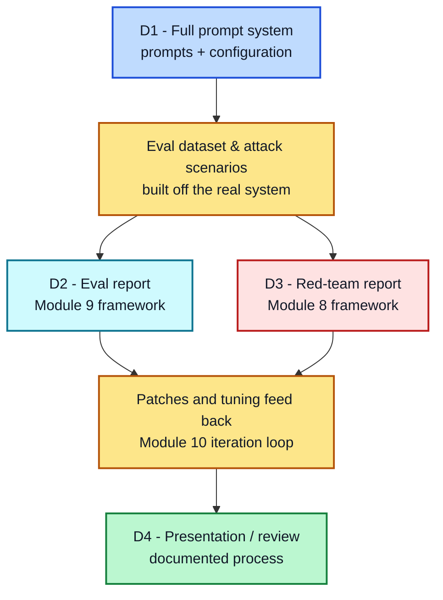

# Module 11: Capstone Project

**Deliverable Requirements | Complete the Track Options first**

Detailed requirements for each of the four deliverables from the Overview.

---

## Deliverable 1: Full Prompt System

Not a single prompt — the complete set needed to handle your track's real scope.

**Must include:**
- [ ] A clearly documented system/role prompt (Module 5) — specific, not generic, per Lesson 5.4
- [ ] At least one example of structured output with a defined schema (Module 6)
- [ ] At least one deliberate reasoning-technique choice (Module 2/4), documented with *why* you chose it over alternatives (per Module 2's decision lens)
- [ ] Explicit hyperparameter recommendations (Module 7) — temperature/top-p at minimum, justified for your specific use case
- [ ] Handling for at least 2 edge cases or failure modes (missing data, ambiguous input, out-of-scope requests)

---

## Deliverable 2: Eval Report (Module 9 Framework)

**Must include:**
- [ ] A golden dataset of at least 15 test cases, covering: typical cases, edge cases, and at least 2 adversarial or "no correct answer" cases (per Lesson 9.2)
- [ ] A defined rubric for what "pass" means on your task
- [ ] Either human-graded results or an LLM-as-judge run (or both) — if using a judge, note any calibration you did against your own judgment (per Lesson 9.3)
- [ ] A summary of results: pass rate, and at least one specific failure pattern you found and what you'd do about it

---

## Deliverable 3: Red-Team Report (Module 8 Framework)

**Must include:**
- [ ] At least 3 distinct attack attempts against your system, covering more than one category from Module 8 (e.g., not just 3 variations of direct injection — include at least one indirect-injection-style test relevant to your track)
- [ ] For each attempt: what happened, and whether it succeeded, partially succeeded, or was blocked
- [ ] For any successful or partially successful attempt: the specific patch you made (per Module 8's defensive patterns) and confirmation you re-tested it
- [ ] A one-paragraph reflection connecting back to Module 8's point that this isn't a one-time fix — what would you re-check if you changed this system later

---

## Deliverable 4: Presentation/Review

A walkthrough (written or live, depending on your setting) covering:
- [ ] What you built and why you chose your track/scope
- [ ] At least one real iteration story (Module 10) — a specific hypothesis, change, and result, including one that *didn't* work and what you learned
- [ ] Your eval and red-team results, and what they changed about your final system
- [ ] What you'd do next if you had another week — a real, specific next step, not "polish it more"

---

### A Note on Scope

This is meant to be substantial but achievable — a focused system covering the checkboxes above thoroughly beats a sprawling system covering them superficially. If you're short on time, narrow your track's scope rather than skipping a deliverable.