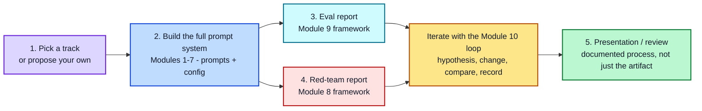

# Module 11: Capstone Project

**Estimated time: 15-20 min read, plus project time** | **Prerequisite: All prior modules**

Every module so far has practiced one skill in isolation. The capstone is where that stops — you'll build one complete, working prompt system and put it through the same rigor a real production team would: designed deliberately, evaluated against a real dataset, red-teamed against real attack patterns, and documented well enough that someone else could pick it up and understand your decisions.

## What You're Building

A single end-to-end prompt system for one real use case. Pick one of the three tracks in [track_options.md](./track_options.md) (or propose your own, if it's comparable in scope), and build a system — not just a single prompt — that could plausibly be handed to a team to deploy.

## Why This Structure

Each of the four deliverables maps directly back to a block of this course, so the capstone isn't a new skill — it's an integration exercise:

| Deliverable | Course modules it draws on |
|---|---|
| Full prompt system | Modules 1-7 (foundations through hyperparameters) |
| Eval report | Module 9 (evaluation framework) |
| Red-team report | Module 8 (security framework) |
| Presentation/review | Module 10 (iteration workflow — you're presenting your documented process, not just a final artifact) |

## The Four Deliverables, Briefly

1. **Full prompt system** — not one prompt, but the set of prompts (and their configuration — Module 7) needed to actually handle the use case, including edge cases and error handling.
2. **Eval report** — a golden dataset, judge (or human) scoring, and results, built using Module 9's framework.
3. **Red-team report** — documented attack attempts and the patches that resulted, using Module 8's framework.
4. **Presentation/review** — a walkthrough of your system and your iteration history (Module 10), not just the finished prompts — the reasoning matters as much as the result.

See [track_options.md](./track_options.md) for track options, [deliverable_requirements.md](./deliverable_requirements.md) for detailed requirements per deliverable, [submission_checklist.md](./submission_checklist.md) for the final submission checklist and grading rubric — and [project_roadmap.md](./project_roadmap.md) for a suggested timeline, milestone checkpoints, and a worked example to calibrate scope.