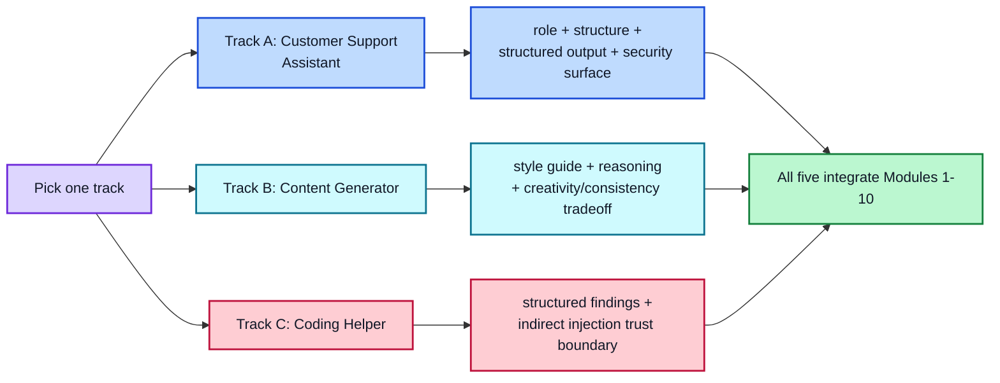

# Module 11: Capstone Project

**Track Options | Complete the Overview first**

Pick one track below. Each is scoped to need real use of Modules 1-10 — techniques, structure, hyperparameters, security, and evaluation — not just a single clever prompt.

---

## Track A: Customer Support Assistant

**Scenario:** An AI assistant that reads incoming customer messages, classifies the issue type, drafts a reply, and decides whether to escalate to a human.

**Minimum scope:**
- Handles at least 4 distinct issue categories (e.g., billing, technical, account, general)
- Produces structured output (Module 6) for the escalation decision, not just free text
- Includes at least one few-shot example set (Module 3) tuned to your specific product/brand voice
- Explicit escalation logic — what confidence level or issue type triggers human review (ties to Module 8's human-in-the-loop pattern)

**Why this track is a strong test:** it touches role/context (Module 5), structured output (Module 6), and has an obvious, realistic security surface (a support bot reading user-submitted, potentially adversarial text — Module 8) and an obvious evaluation need (did it classify and escalate correctly — Module 9).

---

## Track B: Content Generator

**Scenario:** A tool that generates first drafts of a specific content type (e.g., product descriptions, social captions, internal announcements) matching a defined style guide, at scale.

**Minimum scope:**
- A defined "style guide" the system must consistently follow (tone, length, banned phrases, required elements)
- At least one reasoning-technique application (Module 4) — e.g., a planning step before the final draft for longer content
- Hyperparameter reasoning (Module 7) — justify your temperature/top-p choice given the tension between creativity and consistency
- A batch-mode angle: your eval report should test consistency across many generations, not just one good example

**Why this track is a strong test:** it stress-tests the tension between the "high temperature for creativity" and "low temperature for consistency" advice from Module 7 — you have to actually resolve that tradeoff for a real use case, not just cite it.

---

## Track C: Coding Helper

**Scenario:** An assistant that reviews a code snippet for a specific category of issue (e.g., security vulnerabilities, style-guide violations, or missing error handling) and returns structured findings.

**Minimum scope:**
- Structured output (Module 6) with at minimum: issue location, severity, and explanation
- Chain-of-Thought or least-to-most reasoning (Module 4) for anything beyond simple pattern-matching
- A real security angle specific to this track: code snippets are exactly the kind of untrusted content Module 8 warns about — your red-team report should specifically test whether malicious content *inside* a submitted code snippet can manipulate the assistant's own behavior (indirect injection), not just whether a user can type a jailbreak directly

**Why this track is a strong test:** it's the closest analog in this course to the real GitHub Copilot case study from Module 8 — a system that processes untrusted content and needs a genuine trust boundary, not just a polite refusal.

---

## Proposing Your Own Track

If none of these fit, you can propose a different use case — but it must include: multiple distinct input categories or scenarios (not one narrow task), a real reason to use structured output, a real reason someone might try to misuse or break it, and a real way to measure whether it's actually working. Get this approved before building if you're doing this in a cohort/instructor-led setting.