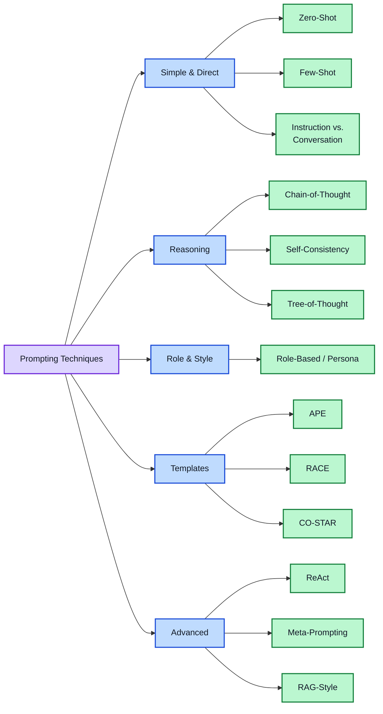
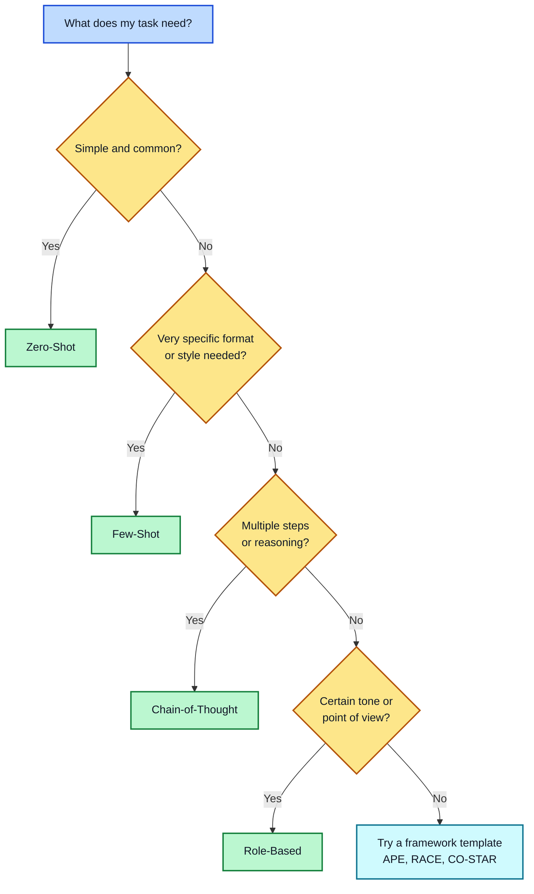

# Module 2: Prompting Techniques Taxonomy

**Estimated time: 30-35 min** | **Prerequisite: Module 1**

There's more than one way to prompt an AI, and different tasks respond better to different approaches. This lesson walks through the core techniques, when to reach for each one, and a simple example of each.



---

## 1. Zero-Shot Prompting

You give the model an instruction with no examples, and it relies on what it already knows. Use it for simple, common, well-understood tasks — basic questions, everyday writing, simple classification.

**Example:**
```
Classify the text into neutral, negative, or positive.
Text: I think the vacation is okay.
```

**When to use:**
- Simple, straightforward tasks
- When the model already understands the task type
- Quick tasks where examples aren't needed

**Pros:**
- Fast to write
- No examples needed
- Works well for common tasks

**Cons:**
- Less control over output format
- May produce inconsistent results
- Struggles with complex or niche tasks

---

## 2. Few-Shot Prompting

You add a couple of examples before your real request, so the model can see the exact pattern you want and copy it. This is called **in-context learning** — the model learns the pattern from the examples in the prompt itself, without being retrained. Reach for few-shot when zero-shot isn't giving you the format, tone, or accuracy you need.

**Example:**
```
Text: Yikes! That's a tricky one. → Neutral
Text: Amazing, that's just amazing. → Positive
Text: I think the food is okay. →
```

Few-shot is especially useful for content that needs to sound like you or match a specific style, and for structured tasks like data extraction where the output format has to stay consistent every time.

**When to use:**
- Tasks requiring specific output format
- Classification tasks
- When zero-shot gives inconsistent results
- Teaching the model a new pattern

**Pros:**
- More consistent outputs
- Clear format demonstration
- Better control over response style

**Cons:**
- Uses more tokens
- Examples may bias the model
- Quality depends on example selection

**Tips:**
- Use 3-5 examples (not too many)
- Choose diverse examples
- Order can matter (put similar examples near the task)

---

## 3. Chain-of-Thought (CoT) Prompting

You ask the model to reason through a problem step by step before giving its final answer, instead of jumping straight to a conclusion. This helps a lot on anything involving multiple steps — math, logic puzzles, multi-part decisions.

**Example:**
```
A store had 120 apples. It sold 45 and received a delivery of 30 more.
How many apples now? Let's think step by step.
```

**Output:**
```
Step 1: Start with 120 apples
Step 2: Sold 45 → 120 - 45 = 75 apples
Step 3: Received 30 more → 75 + 30 = 105 apples

Answer: 105 apples
```

A simple way to trigger this: just add **"let's think step by step"** (or similar) to the end of your prompt. It costs a few extra words and often meaningfully improves accuracy on anything with more than one step.

**Variants:**
- **Zero-shot CoT**: Just add "Let's think step by step"
- **Few-shot CoT**: Provide examples with reasoning steps

**When to use:**
- Math and logic problems
- Complex reasoning tasks
- Multi-step decision making
- Tasks requiring explanation

**Pros:**
- Improves accuracy on reasoning tasks
- Makes model's thinking visible
- Easier to debug errors

**Cons:**
- Longer outputs
- More tokens = higher cost
- May over-explain simple tasks

---

## 4. Role-Based / Persona Prompting

You assign the model a role or persona ("You are a senior travel agent") to guide its tone, vocabulary, and point of view. Simple to add to almost any prompt, and often makes output feel more targeted to your use case. Covered in more depth in Module 5.

**Example:**
```
You are a patient, encouraging coding tutor. Explain what a variable is
to someone who has never programmed before.
```

**Common roles:**
- Expert in a field (doctor, lawyer, engineer)
- Teacher/professor
- Customer service representative
- Creative writer
- Code reviewer

**When to use:**
- When you need domain-specific expertise
- To get a specific perspective
- For consistent tone and style
- Teaching and explanation tasks

**Pros:**
- Better domain-specific responses
- Consistent persona
- Can access specialized knowledge patterns

**Cons:**
- May still give generic advice
- Role doesn't replace actual expertise
- Can be misleading if model's knowledge is outdated

---

## 5. Prompt Frameworks (Fill-in-the-Blank Templates)

Frameworks give you a repeatable structure to fill in, which is useful when you're new to prompting or want consistency across a team. A few common ones:

### APE — Action, Purpose, Expectation

Simple, general-purpose starting point.

```
[Action]: Summarize this article
[Purpose]: Extract key points for a weekly newsletter
[Expectation]: 150-word summary in bullet points, neutral tone

Article: [paste article here]
```

### RACE — Role, Action, Context, Expectation

Common for everyday work tasks.

```
[Role]: You are a marketing manager
[Action]: Write a product launch email
[Context]: New wireless earbuds, targeting young professionals, $99 price point
[Expectation]: 200-word email, enthusiastic tone, include CTA button text
```

### CO-STAR — Context, Objective, Style, Tone, Audience, Response

Useful when tone and format both matter.

```
[Context]: We're a startup launching a new productivity app
[Objective]: Write a Twitter thread announcing the launch
[Style]: Casual, tech-savvy
[Tone]: Excited but not salesy
[Audience]: Software developers and startup founders
[Response]: 5-tweet thread with hashtags
```

You don't need to memorize all of these — pick one that matches your task and fill in the blanks.

---

## 6. Self-Consistency

**Definition**: Running the same prompt multiple times and selecting the most common answer.

**How it works**: Generate multiple responses, then take the majority vote.

**Example process:**
```
Prompt: "Is 17 a prime number? Think step by step."

Run 1: "17 is prime because..." → Yes
Run 2: "17 is only divisible by 1 and 17..." → Yes
Run 3: "Testing divisibility: not divisible by 2, 3, 5..." → Yes

Consensus: Yes (3/3 agree)
```

**When to use:**
- Tasks with clear right/wrong answers
- Math problems
- Factual questions
- When accuracy matters more than speed

**Pros:**
- Higher accuracy than single runs
- Reduces random errors
- Good for critical decisions

**Cons:**
- Multiple API calls = higher cost
- Slower response time
- Only works for tasks with verifiable answers

---

## 7. ReAct (Reasoning + Acting)

**Definition**: Combining reasoning with actions (tool use) in an interleaved pattern.

**How it works**: The model alternates between thinking and taking actions (like searching, calculating, reading files).

**Example:**
```
Question: What is the population of the capital of France?

Thought 1: I need to find the capital of France first.
Action 1: Search("capital of France")
Observation 1: Paris is the capital of France.

Thought 2: Now I need to find the population of Paris.
Action 2: Search("population of Paris 2024")
Observation 2: Paris has approximately 2.1 million people (city proper).

Thought 3: I have the answer.
Answer: The population of Paris (capital of France) is approximately 2.1 million.
```

**When to use:**
- Tasks requiring external information
- Multi-step research problems
- When you need to combine reasoning with data retrieval
- Complex queries that need fact-checking

**Pros:**
- Can use external tools
- Transparent reasoning process
- More accurate for factual queries

**Cons:**
- More complex to set up
- Requires tool integration
- Slower due to multiple steps

---

## 8. Tree-of-Thought (ToT)

**Definition**: Exploring multiple reasoning paths simultaneously and evaluating them.

**How it works**: Instead of one linear chain, the model branches into multiple possibilities and backtracks when needed.

**Example:**
```
Task: Plan a 3-day trip to Tokyo with a $2000 budget.

Thought Branch 1:
  → Day 1: Shinjuku, Day 2: Shibuya, Day 3: Asakusa
  → Budget: $1800 ✓
  → Pros: Balanced mix of areas
  → Cons: Lots of travel between areas

Thought Branch 2:
  → Day 1: Shibuya, Day 2: Shibuya, Day 3: Shibuya
  → Budget: $1200 ✓
  → Pros: Less travel, deeper exploration
  → Cons: Misses other areas

Thought Branch 3:
  → Day 1: Disney Sea, Day 2: Akihabara, Day 3: Kyoto day trip
  → Budget: $2200 ✗ (over budget)
  → Pros: Diverse experiences
  → Cons: Over budget, too ambitious

Best path: Branch 1 (balanced, within budget)
```

**When to use:**
- Creative problem solving
- Strategic planning
- Tasks with multiple valid approaches
- When you need to evaluate alternatives

**Pros:**
- Explores multiple solutions
- Better for complex decisions
- Can avoid local optima

**Cons:**
- Very token-intensive
- Slower than linear approaches
- May over-complicate simple tasks

---

## 9. Meta-Prompting

**Definition**: Using prompts to generate or optimize other prompts.

**How it works**: The model helps you create better prompts.

**Example:**
```
I want to write a prompt that generates professional business emails.

My draft prompt: "Write a business email"

Please improve this prompt by:
1. Identifying what's missing
2. Adding specificity
3. Suggesting a better structure
4. Providing the improved version
```

**When to use:**
- Optimizing existing prompts
- Creating prompt templates
- Learning prompt engineering
- Building prompt libraries

**Pros:**
- Leverages model's knowledge of good prompts
- Iterative improvement
- Educational

**Cons:**
- Requires understanding of what makes prompts good
- May need multiple iterations
- Quality depends on meta-prompt quality

---

## 10. RAG-Style Prompting

**Definition**: Retrieval-Augmented Generation - combining prompt with retrieved relevant documents.

**How it works**: First retrieve relevant context, then include it in the prompt.

**Example:**
```
Context from knowledge base:
[Document 1]: Company policy allows 20 days paid leave per year.
[Document 2]: New employees accrue leave monthly, 1.67 days/month.
[Document 3]: Leave requests must be submitted 2 weeks in advance.

Question: How many leave days can a new employee take after 3 months?

Answer based on the context: A new employee after 3 months has accrued 
approximately 5 days of leave (1.67 days × 3 months).
```

**When to use:**
- Questions about specific documents
- Customer support with knowledge base
- Legal, medical, or technical Q&A
- When accuracy matters and you have source material

**Pros:**
- More accurate (uses real data)
- Reduces hallucination
- Can cite sources

**Cons:**
- Requires retrieval system
- Quality depends on retrieved documents
- More complex infrastructure

---

## 11. Instruction-Style vs. Conversation-Style

### Instruction-Style
**Definition**: Direct, structured prompts with clear commands.

**Example:**
```
Task: Summarize the following article
Length: 100 words max
Audience: General public
Tone: Neutral, factual

[Article text here]
```

**Best for:**
- Automation
- API integrations
- Consistent outputs
- Production systems

### Conversation-Style
**Definition**: Natural, dialog-like prompts that feel like talking to someone.

**Example:**
```
Hey, I've got this article about climate change that's pretty long. 
Can you give me the key points? I need to explain it to my team 
who aren't experts, so keep it simple and around 100 words.
```

**Best for:**
- Interactive sessions
- Brainstorming
- When you need to iterate
- Casual use

### Comparison

| Aspect | Instruction-Style | Conversation-Style |
|--------|-------------------|-------------------|
| Clarity | Very clear | May be ambiguous |
| Speed | Faster to process | Slower, more tokens |
| Consistency | More consistent | More variable |
| Use case | Production, automation | Interactive, brainstorming |
| Ease of writing | Requires structure | More natural |

---

## Choosing a Technique



A simple way to decide:

- **Is the task simple and common?** → Zero-shot
- **Do you need a very specific format or style?** → Few-shot
- **Does it involve multiple steps or reasoning?** → Chain-of-Thought
- **Do you want a certain tone or point of view?** → Role-based
- **Not sure where to start?** → Use a framework template (APE, RACE, CO-STAR)

These techniques also combine — a role-based prompt can also use few-shot examples and ask for step-by-step reasoning, all at once.

---

## Combining Techniques

Most real-world prompts combine multiple techniques:

**Example: Role + Few-Shot + Chain-of-Thought**
```
You are a senior data analyst.

Classify these customer reviews as positive, negative, or neutral.
Show your reasoning for each.

Examples:
Review: "Great product, fast shipping!" → Positive
(Reasoning: Expresses satisfaction with product and shipping)

Review: "Arrived broken, no response from support" → Negative
(Reasoning: Product issue AND poor support = negative)

Now classify:
Review: "Product is fine but shipping took forever" →
```

---

## Key Takeaways

1. **No single best technique** – Choose based on your task
2. **Combine techniques** – Mix approaches for better results
3. **Start simple** – Try zero-shot first, add complexity as needed
4. **Consider cost** – More complex techniques = more tokens = higher cost
5. **Iterate** – Test and refine your approach
6. **Match technique to task** – Use the selection guide above
