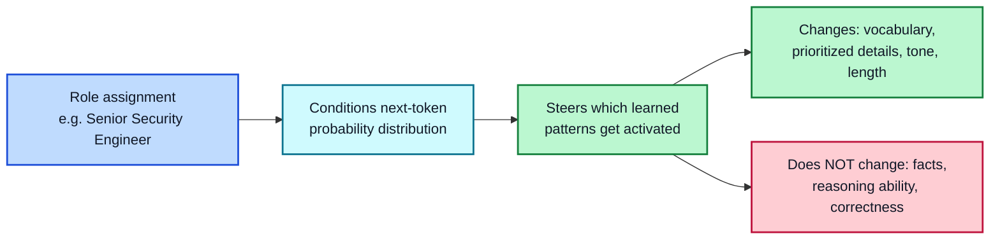
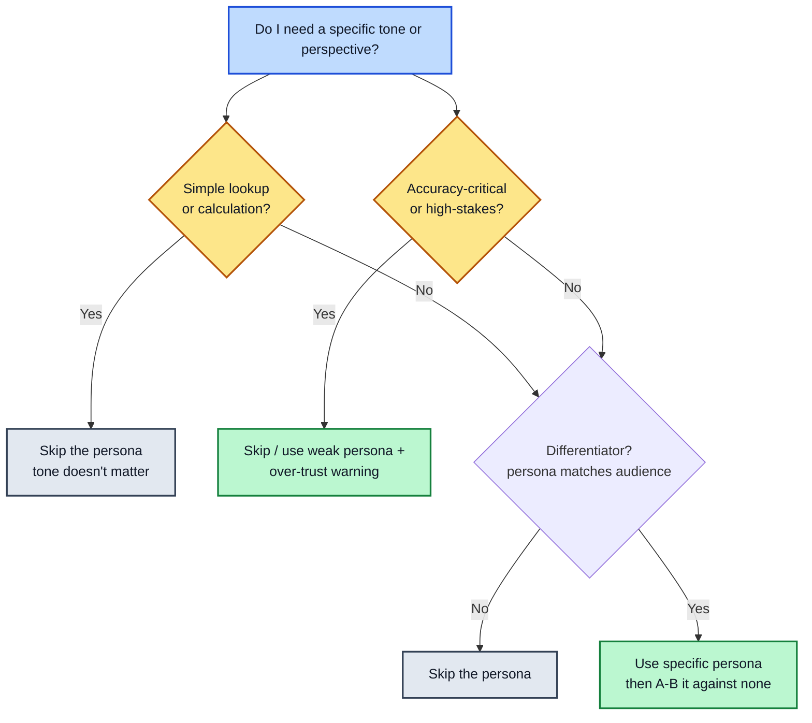

# Module 5: Role & Context Setting

**Estimated time: 30-35 min** | **Prerequisite: Module 2**

Telling the model "you are a ___" has been a default best practice since ChatGPT launched. This lesson looks at what role prompting actually does under the hood, what the research really says about its value, and why the context you set around a role matters more than the role itself.

---

## 5.1 How Role Prompting Works

Roles work by nudging which learned patterns the model draws on. An LLM's training data includes vast amounts of text written *as* doctors, lawyers, teachers, support agents, and engineers. When you assign a role, you're steering the model toward the slice of its knowledge associated with that identity — its vocabulary, its concerns, its typical sentence structure, even its default thoroughness.

**What a role changes:**
- Vocabulary ("exploit", "patch", "attack surface" vs. "issue", "fix", "problem")
- What details get prioritized (a pilot mentions weather; a mechanic mentions maintenance)
- Tone and formality (cautious and hedged vs. enthusiastic and plain)
- Typical output length and structure

**What a role does NOT change:**
- The underlying facts the model knows
- Its actual reasoning ability
- Whether the answer is correct



**Example:**
```
You are a senior security engineer reviewing a pull request. Point out
any authentication or input-validation issues you notice below.
```

**Why this works as well as it does:** the model's next-token predictions (recall Module 1) are strongly conditioned on the context so far. "You are a senior security engineer" primes the entire probability distribution of what comes next — exactly the same mechanism that makes few-shot examples work.

---

## 5.2 The Research Is Genuinely Mixed

If roles only reshape wording, you'd expect accuracy to stay flat. That's roughly what the research shows — and it's worth knowing before you default to personas:

- Multiple recent studies found that **persona instructions in system prompts did not improve performance** across a range of benchmark tasks
- A separate line of research found that **personas could actively hurt accuracy** on zero-shot reasoning tasks
- Where positive effects appeared, they were **small, inconsistent across tasks, and unpredictable in advance** — researchers couldn't reliably guess which persona would help before testing it

**Bottom line:** treat role prompting as a **tone and framing tool, not an accuracy tool**. It reliably changes how an answer *sounds* and what it emphasizes; it does not reliably make an answer *more correct*. When correctness is the goal, invest in context, constraints, and the reasoning techniques from Module 4 — those move accuracy. Roles mostly move style.

---

## 5.3 The Over-Trust Risk

Because roles make outputs sound domain-appropriate and confident, they can inflate perceived credibility without adding real expertise. A "financial advisor" persona doesn't lend the model any licensing, fiduciary duty, or verification of the numbers — it just sounds like it does.

This is a genuine product risk: in testing, users rate role-framed AI answers as more trustworthy even when the underlying content is identical or wrong. If you're shipping a role-based assistant in a high-stakes domain (finance, health, legal), plan for this in the prompt itself:

- **State that it's an AI**, not a credentialed professional
- **Add a verification nudge** — "confirm this with a licensed professional"
- **Message uncertainty** — "I can't verify this" rather than a confident guess

```
You are an AI assistant giving general tax information — you are NOT
a licensed tax advisor. Present options with their tradeoffs, flag
uncertainties, and encourage the user to confirm with a professional.
```

This keeps the tone benefits of a role while defending users (and you) from the blind-trust trap.

---

## 5.4 Practical Guidelines for Roles That Actually Help

Given the mixed evidence, these practices make roles more likely to add value:

**1. Be specific, not generic**
"You are a helpful assistant" adds almost nothing — it's the model's default state. "You are a senior tax accountant focused on small-business deductions" gives the model a much sharper pattern to draw from.

**2. Use neutral, non-stereotyped roles when role content doesn't matter**
The model's training data carries associations about gender, age, and personality for certain jobs. For tasks where those traits are irrelevant, keep roles neutral to avoid importing stereotypes.

**3. Reinforce the role in long or multi-turn conversations**
A role holds well for a single response. Across a long chat it drifts — earlier context falls out of the window (Module 1), and the model gradually behaves like "generic assistant" again. Restate the role periodically, or pin it in a persistent system prompt.

**4. Combine the role with real constraints and context**
A role alone only changes style. The Task, Constraints, and Examples from Module 1 are what determine whether the output is actually useful. Treat the role as the seasoning, not the dish.

---

## 5.5 Context Setting Beyond Roles

A role is one kind of context, but "context setting" means everything the model needs that it can't infer. Three categories do most of the work:

**Audience** — who reads this, and what they already know
```
Audience: first-time investors, comfortable with basic math, no finance jargon.
```

**Prior state** — what's happened, been tried, or been decided already
```
The user already reinstalled the app and restarted the router before contacting us.
```

**Real-world constraints** — budget, deadline, policy, available tools
```
Budget limit is $500, deadline is Friday, and we cannot offer store credit for cash refunds.
```

**Role + context example:**
```
You are a customer support specialist for a project management SaaS.
The customer has already tried restarting the app and clearing their
cache per our support macro, and this is a second email about the same bug.
Write a reply that acknowledges the repeat contact and escalates to engineering.
```

The role ("support specialist") does the tone work; the context (already tried fixes, repeat contact, escalation path) is what makes the reply situationally correct. That division is the core takeaway of this lesson.

---

## 5.6 When to Skip the Persona

Given the mixed research, roles are often unnecessary. Skip them when:

- **The task is a simple lookup or calculation** — tone doesn't matter, the persona only costs tokens
- **Accuracy is the priority** and you have no evidence a persona helps (test it rather than assume)
- **The domain is high-stakes** — an authoritative-sounding role risks over-trust more than it adds value

A quick way to weigh the decision:



A quick test that settles most debates: run the task once with the persona and once without, and compare. If the difference is only cosmetic, drop it.

---

## Key Takeaways

1. **Roles steer patterns, not knowledge** — they change tone and emphasis
2. **Research says roles don't reliably improve accuracy** — and can hurt reasoning tasks
3. **Beware over-trust** — authoritative roles inflate perceived credibility
4. **Specific beats generic** — "senior tax accountant" > "helpful assistant"
5. **Context is broader than role** — audience, prior state, and constraints do the heavy lifting
6. **Skip personas where they add cost without value** — lookups and high-stakes domains