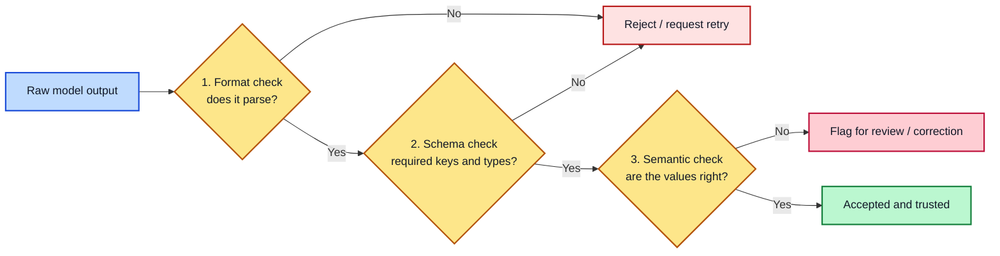

# Module 6: Output Control & Structured Data

**Estimated time: 30-35 min** | **Prerequisite: Module 3**

Free-form text is fine for a human to read, but once an AI's output needs to feed into another system — a database, a spreadsheet, another piece of code — reliability of format becomes just as important as the content itself. This lesson covers how to get consistent, machine-readable output, and where its guarantees actually stop.

---

## 6.1 Why This Matters

A narrative paragraph is easy for a person to skim, but nearly useless to a program. If a support email response is supposed to contain a customer name and an order number, parsing those out of free text fails a meaningful fraction of the time — the phrasing drifts, the fields move around, words get reordered. In production this shows up as quiet data loss: records written with blank fields, rows discarded by parsers, ETL jobs that silently skip entries.

Structured output — enforcing a specific format such as JSON — collapses that error rate dramatically. When every response has a fixed, predictable shape, the downstream code never has to guess where anything is. That's why almost every production system that pipes AI output into other software constrains the format rather than parsing free text. Two consequences to note upfront:

- Adding a format constraint safely handles most message *content* problems
- It says nothing about whether the message *values* are correct (see 6.4)

---

## 6.2 Schema-First Prompting

The simplest approach, and one that works on any model: show the exact shape you want, directly in the prompt, before the input content.

**Example:**
```
Extract the following fields from the support email below and return
ONLY valid JSON in this exact shape:

{
  "customer_name": string,
  "order_id": integer,
  "sentiment": "POSITIVE" | "NEUTRAL" | "NEGATIVE",
  "summary": string (one sentence)
}

Email: "Hi, this is John Doe, my order #12345 arrived a week late and
I'm pretty frustrated about it."
```

**Practices that make schema-first prompting noticeably more reliable:**

**1. Spell out allowed values for enum fields**
Don't leave `"sentiment"` open-ended — the model will invent "angry" or "positive-ish". Listing `"POSITIVE" | "NEUTRAL" | "NEGATIVE"` bounds the possible answers.

**2. Say "ONLY valid JSON" explicitly**
Models love adding a friendly preamble like "Sure! Here's the JSON:" before the object — which breaks naive parsers. The explicit instruction is a cheap, effective fix.

**3. Use a JSON schema notation for types**
Writing `"order_id": integer` beats `"order_id": "the order number"`. The model maps your description onto the shape more faithfully when the field types are explicit.

**4. Keep field names stable**
Downstream code keys off `customer_name`. If a future prompt version renames it to `name`, the extractor breaks. Treat field names as a contract.

---

## 6.3 Native JSON Mode / Structured Outputs (API-Level)

Most major model providers now expose API-level features that constrain output *during generation* rather than only via prompt wording. They come in two distinct strengths, and it's important not to confuse them:

| Feature | Guarantee | What it means |
|---------|-----------|---------------|
| **JSON mode** | Output is syntactically valid JSON | It will parse — but it can be any JSON at all |
| **Structured outputs / schema enforcement** | Output matches a specific schema you supply | Field names, types, and structure are enforced at generation time |

**JSON mode** tells the generator "produce valid JSON" — great for eliminating the "Sure! Here's the JSON:" problem, but it won't stop the model from returning `{"result": "random extra key"}` when you asked for three specific fields.

**Structured outputs** take a real JSON schema from you and constrain each token to fit it. This is enforced at generation time — the difference between asking nicely and installing guardrails.

Key practical point: this is a **setting on the API call, not something you control through prompt wording** (covered further in Module 7: Hyperparameters). If your platform offers schema enforcement, prefer it over prompting alone — it's more reliable than even a well-written schema-first prompt.

---

## 6.4 The Limitation Nobody Should Skip: Schema Conformance ≠ Correctness

The most important caveat in this entire module: a response can be **perfectly valid JSON, exactly matching your schema, field types and all — and still be wrong.**

Schema enforcement guarantees the *shape* is inspectable by your code. It says nothing about whether the *values inside* are accurate. A sentiment field can confidently return `"POSITIVE"` for a clearly furious email and still be 100% schema-valid.

**Practical implication:** structured output removes *parsing* errors, not *judgment* errors. Your downstream system still needs **semantic validation** — rule-based checks that the extracted values actually make sense — kept separate from the format check that confirms "this is valid JSON."

```
1. Format check:   json.loads(output)          → did it parse?
2. Schema check:   required keys present?         → is the shape right?
3. Semantic check: is sentiment actually "NEGATIVE"?  → is the value right?
```



Steps 1-2 are usually free and automated. Step 3 is where the real QA lives.

**Illustrative check** (conceptual — adapt to your stack):

```python
import json

output = model_response                      # from your API call
data = json.loads(output)                    # 1. Format check (fails fast)

required = {"order_id", "customer_email"}    # 2. Schema check
assert required <= set(data), f"missing {required - set(data)}"

if data["sentiment"] not in {"POSITIVE", "NEGATIVE", "NEUTRAL", "UNKNOWN"}:
    raise ValueError(data["sentiment"])      # 3. Semantic check: value in allowed set
if len(str(data["order_id"])) not in (8, 9):
    raise ValueError("order_id looks malformed")
```

Write these as unit tests in your CI (Module 9's sanity checks) so a release with a broken extraction fails fast instead of silently corrupting data.

---

## 6.5 Few-Shot for Structured Extraction

Combining Module 3's few-shot examples with structured output is one of the most reliable combinations in this course. A handful of well-chosen input→JSON examples consistently beats a long prose instruction describing the schema — and it usually costs fewer tokens too.

**Example:**
```
Email: "Hi, I'm Maria Lopez, order #98212 never arrived."
→ {"customer_name": "Maria Lopez", "order_id": 98212, "sentiment": "NEGATIVE"}

Email: "Thanks so much, order #55810 came early, love it!"
→ {"customer_name": null, "order_id": 55810, "sentiment": "POSITIVE"}

Email: "{{REAL_INPUT}}"
→
```

Note how the second example handles a **missing field** — no name was given, so it maps to `null` rather than inventing one. This is the key advantage of few-shot for extraction: instead of telling the model "use null when data is missing," you *show* it the behavior. Models copy demonstrated patterns more reliably than they follow abstract instructions.

---

## 6.6 Handling Missing or Ambiguous Data

Every real extraction pipeline hits gaps. Decide upfront what should happen when a field can't be determined, and say it explicitly — otherwise the model will pick one of the bad options:

- **Invent a plausible value** (worst case — silent fabrication)
- **Break the schema** by omitting the field (also bad — your parser fails)

**The two sane conventions:**

| Approach | Use for | Example |
|----------|---------|---------|
| `null` | Genuinely missing values | `"customer_name": null` |
| `"unknown"` (sentinel) | Enum fields that must always carry a value | `"sentiment": "UNKNOWN"` |

Whatever you choose, be consistent and explicit:

```
If a field cannot be determined from the email, use "unknown" for
sentiment and null for all other fields. Never invent a value.
```

The explicit fallback rule + a few-shot example demonstrating it (6.5) is the strongest combination: the rule tells the model the policy, the example shows it in action.

---

## 6.7 Beyond JSON: Function Calling & Other Structured Formats

JSON is the most common structured output, but it isn't the only one — and JSON isn't always the best tool for the job.

### Function / tool calling

Most major providers offer **function calling**: you register a function (name, description, JSON parameter schema), and the model returns a *call to that function* with arguments instead of free-form text.

- **What it's really for:** connecting the model to your code — "call `place_order(order_id=..., amount=...)`". Structured output gives you data back; tool calling gives you *an action to execute*.
- **Two-step pattern:** step one the model returns `name` + `arguments`; step two *your* code validates and executes the call. The tool call is a *request to run code*, never a bypass of your own validation (Link to Module 8: this is also the injection surface you must guard).
- **When to use it over JSON mode:** you actually want to *do* something (search, write, mutate state), or you're building an agent. If you only want data back, plain structured output is simpler.

### Format rainbow: when JSON is the wrong default

| Format | Best when | Caveats |
|--------|-----------|---------|
| **JSON** | Nested data, programmatic consumption | Verbose for humans; order/clarity matter |
| **CSV / TSV** | Tables, spreadsheets, bulk pipelines | Fragile with erratic quotes, commas in values, or multiline cells |
| **YAML** | Config, human-edited files, most readable | Nested indent mistakes silently fail; some parsers accept insecure types |
| **Plain Markdown / tables** | Human-facing reports, docs | Never feed it to a parser expecting a structured format without strict checks |
| **XML** | High-fidelity interchange with existing systems | Verbose; needs explicit formatting rules to stay well-formed |

**The discipline carries over from 6.4:** whichever format you pick, conformance (it parses, it matches the shape) is separate from correctness (the values are right). Validate both. Function calls especially — validate the *arguments against your own rules* before executing, even when the call itself is schema-valid.

---

## Key Takeaways

1. **Format reliability matters in production** — free text fails to parse far too often
2. **Schema-first prompting works on any model** — show, don't just describe
3. **API-level enforcement is stronger** — structured outputs > JSON mode > prompting
4. **Schema conformance ≠ correctness** — always keep semantic validation separate
5. **Few-shot beats verbose instructions** — demonstrated examples outperform prose
6. **Decide missing-data policy upfront** — `null` or `"unknown"`, never invention
7. **Pick the format that fits the consumer** — JSON isn't always right; validate conformance and correctness in every one