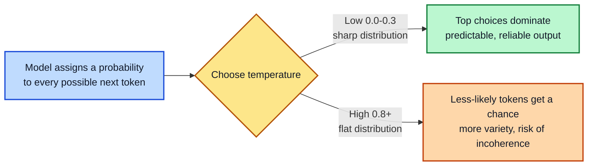
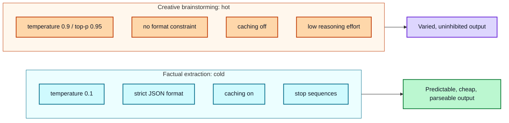

# Module 7: Hyperparameters & Model Configuration

**Estimated time: 40-45 min** | **Prerequisite: Module 6**

Everything so far has shaped output through what you type. This module covers the other lever: settings on the API call itself that shape output independently of prompt wording. These are configured differently depending on your platform (a chat app's settings panel vs. a raw API call), but the concepts transfer everywhere.

**A note on precision:** exact parameter names, ranges, and defaults genuinely differ across providers (OpenAI, Anthropic, Google) and change over time as new model generations ship. This lesson gives you the concepts plus current examples — always check your specific provider's docs before shipping a production setting.

---

## 7.1 Randomness & Sampling Controls

### Temperature

Temperature controls how sharply the model favors its highest-probability next token versus spreading chance across less-likely ones. Under the hood, the model assigns a probability to every possible next token; temperature reshapes that distribution before a token is picked.

- **Low temperature** sharpens the distribution toward the top choices → predictable output
- **High temperature** flattens the distribution → more variety, more risk of incoherence
- Ranges vary by provider — some cap at 1.0, others allow up to 2.0



**Practical starting scale:**

| Range | Typical use |
|-------|-------------|
| 0.0 - 0.3 | Near-deterministic: factual answers, code generation |
| 0.4 - 0.7 | Balanced: general-purpose output |
| 0.8+ | Creative: brainstorming, variation |

*(Code generation commonly runs at 0.0 — but even 0.0 isn't a guarantee of byte-identical output across runs or model versions. For stronger best-effort reproducibility, use `seed` (7.3).)*

### Top-P (Nucleus Sampling)

A different mechanism: instead of reshaping the whole distribution, **top-p keeps only the smallest set of tokens whose combined probability crosses a threshold**, then samples from that set only.

- `top_p = 0.9` → keep adding tokens until their probabilities sum to ~90%, sample from those
- Lower top-p → fewer candidates → more predictable
- Higher top-p → more candidates → more variety

### Top-K

Caps the candidate pool to a **fixed number of the most likely tokens**, regardless of their combined probability.

- `top_k = 40` → sample only from the top 40 most likely tokens

**Important practical note:** most provider docs recommend adjusting *either* temperature *or* top-p, not both — they interact through the same underlying calculation, and tuning both makes the effect of either one hard to reason about. **Top-k** is mostly relevant when running an open-weight model yourself with fine control over decoding. On hosted APIs it's often unexposed or best left at its default.

---

## 7.2 Length & Repetition Controls

### Max Tokens

Sets a hard ceiling on response length. This directly controls cost (most APIs bill per output token) and prevents runaway generations.

**One trap in reasoning models:** on some newer models, "thinking" tokens count against this same limit *before* the model starts its visible answer. A max-tokens value that seemed generous on a simple model can cut a reasoning model off mid-thought.

### Stop Sequences

Strings that end generation the moment they appear — useful for cutting output off at a natural boundary (e.g., a delimiter that marks the end of a structured response).

**Caveat:** some reasoning models don't support stop sequences at all — check your model's docs.

```
Stop: "---END---"
Prompt: ...answer in the format below---END---
Output stops the moment "---END---" is generated
```

### Frequency Penalty & Presence Penalty

Both discourage repetition, but by different math — and they aren't available everywhere.

- **Frequency penalty** scales with how many times a token has already appeared — the more it repeats, the harder it's penalized
- **Presence penalty** applies a flat penalty the moment a token has appeared at all, regardless of count — nudges the model toward new topics

**Current landscape (as of writing):** OpenAI exposes both; Anthropic doesn't; and it's genuinely unclear whether either has a meaningful effect on reasoning models even where technically available. Test before relying on them.

### Logit Bias

Nudges the likelihood of *specific* tokens up or down — a surgeon's scalpel compared to the broad brush of temperature.

```
logit_bias: {"2435": 10, "31856": -100}   # boost token 2435, suppress token 31856
```

Useful for forcing or forbidding particular words — e.g., always emitting a specific metric name. Only exposed on some APIs.

---

## 7.3 Format, Reasoning & Reproducibility

### JSON Mode / Structured Outputs

Covered in Module 6 — worth remembering that these are configured **at the API level**, not just through prompt wording.

### Reasoning Effort / Thinking Tokens

Controls how much internal reasoning a model does *before* producing a visible answer. **This is not a single universal setting** — providers implement genuinely different scales:

| Provider (current) | Scale | Default |
|--------------------|-------|---------|
| One major provider | 7 levels, `none` → `max` | `medium` |
| A second | 5 levels, `low` → `max` | `high` |
| A third | 4 levels, `minimal` → `high` | varies by model |

The constant across all of them: **higher effort = more billed tokens + more latency — and not automatically a better answer.** A simple factual lookup doesn't benefit from high reasoning effort; genuinely multi-step problems do.

### Seed

Makes output *more* reproducible — same prompt, same seed, same settings → closer-to-identical output across runs.

**What it actually promises:** best-effort reproducibility, not a guarantee. Provider support varies, and even where supported, hosted infrastructure can drift over time as backends change. Don't build a system that depends on byte-for-byte deterministic output.

---

## 7.4 Performance & Cost

### Streaming

Delivers the response incrementally, token by token, as it's generated — instead of waiting for the full response. This dramatically improves *perceived* speed in user-facing apps, even though total generation time doesn't actually change.

### Prompt Caching

One of the highest-leverage cost levers on longer or repeated prompts. When part of your prompt (system prompt, a large document, tool definitions) stays identical across calls, caching lets the provider reuse processed content instead of reprocessing it. On some platforms cached input is billed at a small fraction of the normal rate.

**The catch:** caching is sensitive to exact configuration. Changing reasoning effort between calls, or restructuring where shared content sits in the prompt, can silently break the cache hit and quietly cost you the savings.

### A cost worked example (illustrative)

Rough numbers (updated pricing varies by provider and by month — this is for the shape of the thinking, not for quoting):

| | Input tokens | Output tokens | Rate (input / output) | Cost per call |
|--|--------------|---------------|----------------------|---------------|
| Long-context call (cached) | 40,000 system doc (cached) + 2,000 new | 800 | ~$0.10 / ~$0.40 per 1M | ~$0.0005 |
| Same, cache miss | 42,000 uncached | 800 | ~$0.10 / ~$0.40 per 1M | ~$0.0045 |
| Same, long output (5,000 tokens) | 42,000 uncached | 5,000 | ~$0.10 / ~$0.40 per 1M | ~$0.006 |
| Same, with reasoning effort high | 42,000 + ~15,000 hidden thinking | 5,000 | ~$0.10 / ~$0.40 per 1M | ~$0.009 |

Three takeaways that generalize: (1) a cache hit on a long shared system prompt can cut per-call cost by an order of magnitude; (2) output (and hidden thinking) tokens often cost more per token than input — trimming output buys more than trimming input; (3) at high volume even "small" differences matter — a $0.0045→$0.0005 saving on a single call is 9x on millions of calls. Estimate against your provider's current published rates before choosing a plan.

---

## 7.5 Parameter Names Across Providers

Every provider exposes the same underlying concepts, but names and behavior differ. The table maps the common ones — **always verify against your provider's current reference docs before relying on any of these names**, since APIs change frequently.

| Concept | OpenAI | Anthropic Claude | Google Gemini | Notes |
|---------|--------|------------------|---------------|-------|
| Temperature | `temperature` | `temperature` | `temperature` | Same name, meaning mostly consistent |
| Top-p | `top_p` | `top_p` | `top_p` | Also `top_k` for the fixed-pool cutoff |
| Max output tokens | `max_tokens` / `max_completion_tokens` | `max_tokens` (Claude API historically uses *max_tokens to sample*) | `maxOutputTokens` | Verify units — some newer models count every token |
| Stop condition | `stop` | `stop_sequences` | `stopSequences` | Not supported on all reasoning models |
| JSON-ish constraint | `response_format` | `structured_outputs`/tool-use | `responseMimeType` (`application/json`) / `responseSchema` | Different strengths — see Module 6 |
| Reasoning control | `reasoning_effort` (o-series) | `thinking` (`enabled`, `budget_tokens`) | `thinkingConfig` (`thinking_budget`) | How much hidden reasoning is spent |
| Randomness seed | `seed` | (not a first-class param) | (not a first-class param) | Best-effort reproducibility, not a guarantee |
| Penalties | `presence_penalty`, `frequency_penalty` | — | (not first-class, via sampling params) | Often absent outside OpenAI-style APIs |
| Caching | automatic/v4 caching | `cache_control` on blocks | automatic | Mismatched config silently misses the cache (7.4) |

**The practical lesson:** your prompt code should be written against *your* provider's parameters, not a generic mental model of "the" API. Three things travel well between providers — the *values you set* (0.3 vs 0.9 is a meaningful decision everywhere), the *reproducibility expectation* (seed is never a hard guarantee anywhere), and the *trade-off logic* (hot vs cold from 7.4). Names and exact semantics don't travel — look them up.

---

## 7.6 Putting It Together

Real-world configs mix these dials deliberately. Two contrasting examples:

**Factual structured-extraction task:**
```
temperature: 0.1
max_tokens: 1500
response_format: { "type": "json_object" }
prompt_caching: enabled (same system prompt reused across calls)
stop: ["---END---"]
```
Low randomness, firm length ceiling, strict format, cached prefix — every dial pushing toward predictable, cheap, parseable output.

**Creative brainstorming task:**
```
temperature: 0.9
top-p: 0.95
max_tokens: 2000
reasoning_effort: low
prompt_caching: off (every prompt is unique anyway)
```
Most dials flipped: high randomness, no format constraint, minimal reasoning, caching irrelevant.



---

## Key Takeaways

1. **Temperature sharpens or flattens** the token distribution — the master randomness dial
2. **top-p and top-k restrict the candidate pool** — tune one of temp/top-p, not both
3. **Max tokens controls cost and cuts off runaway output** — watch thinking tokens on reasoning models
4. **Stop sequences end generation at boundaries** — when supported
5. **Reasoning effort ≠ always better** — it trades tokens/latency for depth
6. **Caching is the big cost lever** — but fragile to config changes
7. **Match the config to the task** — extraction is cold and strict; brainstorming is hot and loose