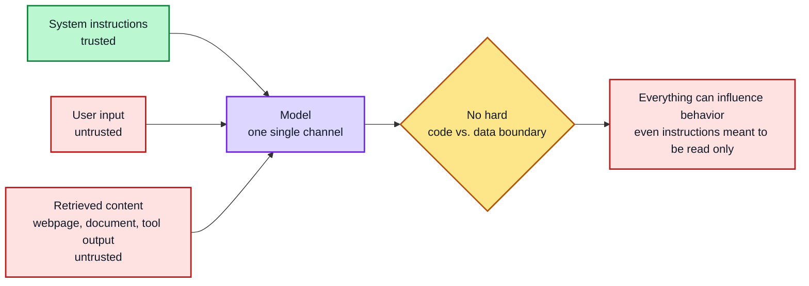
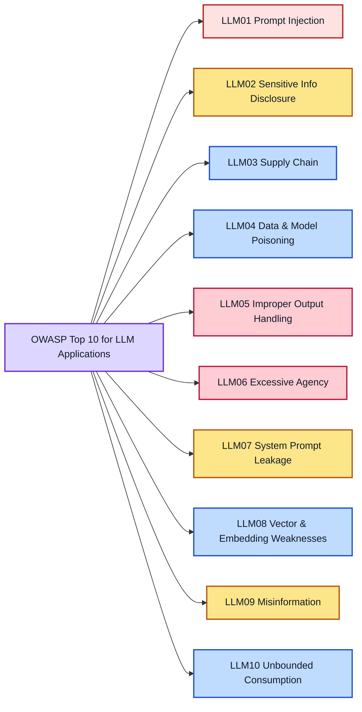
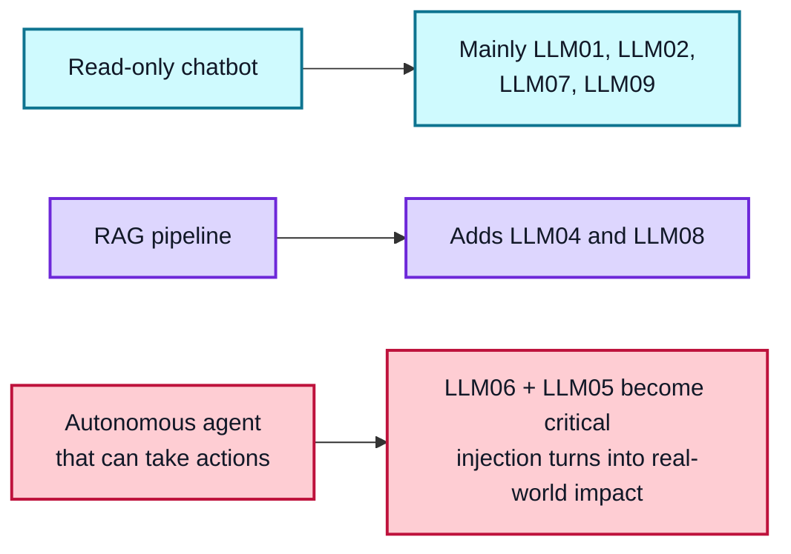
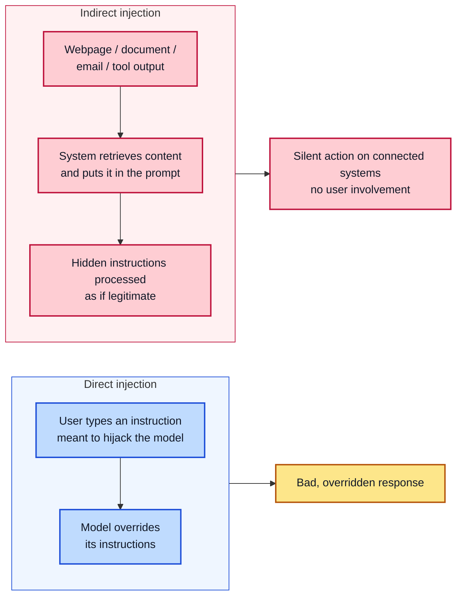
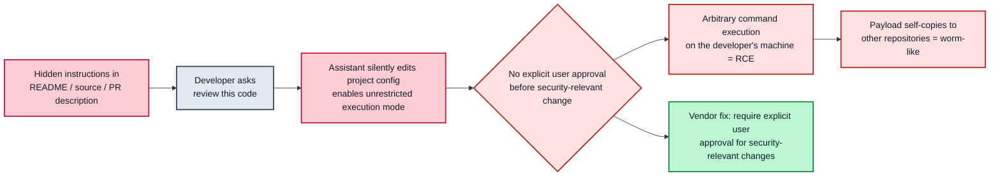
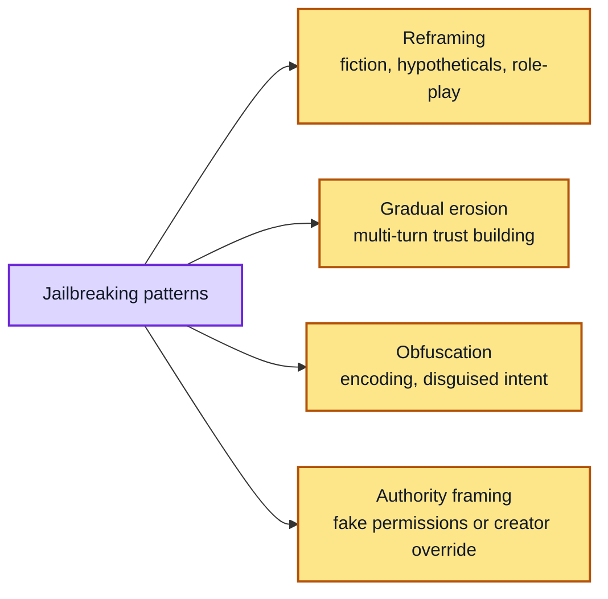
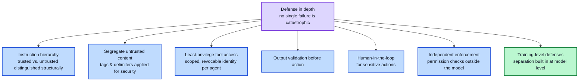
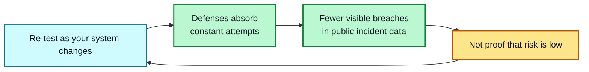

# Module 8: Prompt Security — Injection & Jailbreaking

**Lesson | Estimated time: 55-65 min** | **Prerequisite: Module 5**

Every technique so far has assumed a cooperative user. This module covers what happens when input to your prompt — from a user, or from content your system retrieves — is actively trying to make the model misbehave. This is a live, currently top-ranked production risk: prompt injection has ranked #1 on the OWASP Top 10 for LLM Applications across the 2025 and 2026 editions, and multiple critical, named vulnerabilities against real production AI products in 2025-2026 confirm it's actively exploited, not theoretical.

*This lesson is written for defense: recognizing these risks and designing against them. The case studies below describe publicly disclosed, already-patched vulnerabilities at the level of impact and root cause — not working exploit code or the specific bypass phrasings researchers used. The lab exercises use a safe, fictional test prompt only.*

---

## 8.1 The Core Problem

The reason prompt injection is so hard to fully solve isn't a bug that can be patched once — it's closer to a structural property of how these models work. A model processes system instructions and user/external content through the same channel; unlike traditional software, there's no hard, built-in separation between "code" and "data." Anything in the prompt — including content the model retrieves from a website, a document, or a tool call — is, to varying degrees, capable of influencing its behavior. OWASP's 2026 guidance reframes the goal accordingly: rather than building a model that can never be fooled, design the surrounding system so that when the model is fooled — and it will be, sometimes — nothing critical breaks as a result.

---

## 8.2 The Full Threat Landscape (Not Just Injection)

Prompt injection gets the most attention, but OWASP's Top 10 for LLM Applications covers nine other real categories worth knowing, because production systems are usually exposed to several at once:

- **LLM01 Prompt Injection** — covered in depth below
- **LLM02 Sensitive Information Disclosure** — the model leaks secrets, PII, or confidential data through its outputs or reasoning traces
- **LLM03 Supply Chain** — vulnerabilities from compromised models, training data, libraries, or hosting providers your system depends on
- **LLM04 Data and Model Poisoning** — malicious training, fine-tuning, or retrieval data shapes the model's behavior in ways its owners didn't intend
- **LLM05 Improper Output Handling** — downstream systems trust the model's output and act on it without validation (this is what turns a successful injection into a real exploit — see 8.5's case study)
- **LLM06 Excessive Agency** — the model or agent holds more capability, autonomy, or permission than is actually safe for its task
- **LLM07 System Prompt Leakage** — internal prompts, policies, or tool configurations are exposed to users who shouldn't see them
- **LLM08 Vector and Embedding Weaknesses** — RAG systems' retrieval and embedding pipelines introduce their own attack and leakage paths
- **LLM09 Misinformation** — confidently incorrect output gets acted on as if it were true
- **LLM10 Unbounded Consumption** — missing limits let cost, latency, or capacity be exhausted by abuse

Which of these matter most depends on your system's architecture: a simple read-only chatbot mostly needs to worry about LLM01, LLM02, LLM07, and LLM09; a RAG pipeline adds LLM04 and LLM08; an autonomous agent that can take actions elevates LLM06 and LLM05 sharply, because that's exactly the combination that turns a successful injection into a real-world consequence rather than just a bad text response.

---

## 8.3 Direct vs. Indirect Injection

**Direct prompt injection** happens when a user directly types an instruction intended to override the system's original instructions. This is the most well-known form, because the untrusted input and the attack are the same thing.

**Indirect prompt injection** is more dangerous in practice: malicious instructions hidden inside content the model retrieves or processes — a webpage, a document, an email, the output of a tool call. The user never typed anything malicious; the attack arrives through data the system trusted implicitly. As LLM-integrated applications have gained tool access, memory, and connections to real business systems, indirect injection through these channels has become one of the most active areas of real-world exploitation.

---

## 8.4 Case Study: EchoLeak (CVE-2025-32711)

In June 2025, security researchers disclosed a zero-click indirect prompt injection vulnerability in a major AI-powered productivity assistant, with a severity score of 9.3 out of 10. The attack required no user interaction at all: an attacker could send a single, ordinary-looking email containing hidden instructions — invisible to the human reader through techniques like white-on-white text — and the assistant would process that hidden content as if it were a legitimate instruction, silently exfiltrating the victim's internal documents to an attacker-controlled destination.

**What made this possible, at the architectural level:** the assistant read everything in a document it was asked to summarize or analyze — not just the visible, human-facing text, but hidden text and metadata too — and it lacked a hard boundary between "instructions I should follow" and "content I'm just supposed to read." Researchers found the vulnerability chained together several distinct bypasses of the platform's existing injection defenses to reach this outcome.

**The fix and the broader lesson:** the specific vulnerability was patched, with no evidence of real-world exploitation before disclosure. But security researchers who studied it were clear that the individual bug being fixed doesn't close the underlying attack surface — any AI assistant with access to multiple internal data sources and the ability to act on content it reads is exposed to the same structural pattern. The durable defense isn't patching each specific bypass as it's found; it's scoping what data an assistant can reach *before* it's given a task, per Lesson 8.7's least-privilege principle.

---

## 8.5 Case Study: GitHub Copilot RCE (CVE-2025-53773)

A second, differently-shaped case from the same period: a critical vulnerability in a widely used AI coding assistant let an attacker embed hidden instructions inside ordinary project files — a README, source code, or a pull request description. When a developer asked the assistant something as innocuous as "review this code," the hidden instructions could silently modify the project's own configuration file to enable an unrestricted execution mode, after which the assistant could run arbitrary commands on the developer's machine — full remote code execution, from what looked like a routine code review request. Researchers also demonstrated the payload could copy itself into other repositories on the same machine, giving it a worm-like self-propagating quality reminiscent of early 2000s network worms.

**What made this possible:** the assistant could modify project configuration files without requiring explicit user approval, and there was no default requirement for human confirmation before a security-relevant setting change took effect. This is a direct, concrete illustration of Lesson 8.2's LLM05 (Improper Output Handling) and LLM06 (Excessive Agency) working together — the injection itself was almost the easy part; it was the *unchecked ability to act* on that injected instruction that turned it into a full system compromise.

**The fix:** the vendor patched this by requiring explicit user approval for any security-relevant configuration change — turning an autonomous, silent action into a human-in-the-loop one. That's precisely the defensive pattern in Lesson 8.7 below, applied after the fact rather than designed in from the start.

---

## 8.6 Jailbreaking — At the Pattern Level

Jailbreaking refers to techniques aimed at getting a model to bypass its safety guidelines specifically. Rather than reproducing specific attack scripts, it's more useful to recognize the *categories* these attempts fall into, since attackers constantly rephrase around any specific pattern a defense is built to catch:

- **Reframing attacks** — wrapping a request in fiction, hypotheticals, or role-play to try to distance it from the model's direct guidelines
- **Gradual erosion** — building up trust or context over many conversation turns before making the actual problematic request
- **Obfuscation** — encoding or disguising a request's real intent so it's less recognizable
- **Authority framing** — falsely claiming special permissions, developer access, or an overriding instruction from the model's own creator

---

## 8.7 Defensive Design Patterns

No single defense fully solves prompt injection — the accepted approach is defense in depth, layering multiple independent controls so no single failure is catastrophic:

- **Instruction hierarchy** — architecting the system so trusted instructions are structurally distinguished from untrusted content, not just written differently in the same prompt
- **Segregating untrusted content** — clearly marking which parts of a prompt are trusted instructions versus retrieved or user-supplied data (Module 3's tags/delimiters, applied for security rather than just clarity)
- **Least-privilege tool access and identity** — an agent should only reach the specific tools and data it actually needs; modern practice increasingly gives each agent its own scoped, revocable identity rather than a shared, broadly-permissioned account, specifically to limit blast radius when (not if) an injection succeeds
- **Output validation before action** — checking what the model produces before acting on it, exactly the control that was missing in the Copilot RCE case above
- **Human-in-the-loop for sensitive actions** — anything consequential gets a confirmation step, as the EchoLeak and Copilot fixes both ultimately implemented
- **Independent enforcement of critical controls** — permission checks enforced outside the model itself, in real system logic, regardless of what any prompt says
- **Structured, training-level defenses** — beyond prompting, researchers have developed approaches that build the trusted/untrusted separation into the model's training itself, rather than relying on prompt wording alone, for applications that can adopt specially-tuned models

---

## 8.8 Why This Isn't a One-Time Fix

OWASP's own 2026 methodology notes something worth internalizing: organizations that invest heavily in defense show up with fewer visible successful attacks in public incident data — meaning the absence of headline-grabbing breaches doesn't mean the risk is low; it can mean the defenses are actively absorbing constant attempts. One industry statement on this from late 2025 was blunt: prompt injection for browser-connected agents specifically is "unlikely to ever be fully solved." Treat prompt security as ongoing maintenance, re-tested as your system changes, not a checkbox completed once at launch.

---

## Key Takeaways

1. **Injection is structural, not a one-time bug** — with no hard code/data boundary, design the surrounding system to *contain* successful injections
2. **It's one category out of ten** — knowing LLM01-LLM10 matters because production systems face several at once
3. **Architecture decides priorities** — chatbots, RAG pipelines, and autonomous agents face very different risk profiles
4. **Indirect injection is the practical danger** — hidden instructions arrive through retrieved content, silently
5. **Real exploits pair injection with agency** — LLM05 + LLM06 is what turns a bad text response into a system compromise
6. **Jailbreaks follow recognizable patterns** — reframing, erosion, obfuscation, authority framing — and shift constantly
7. **Defense in depth wins** — hierarchy, segregation, least privilege, output validation, human-in-the-loop, independent enforcement
8. **Treat prompt security as maintenance** — absence of public incidents can mean defenses are absorbing attempts, not that the risk is gone