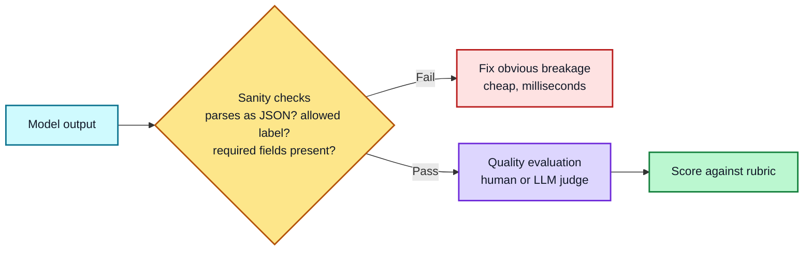
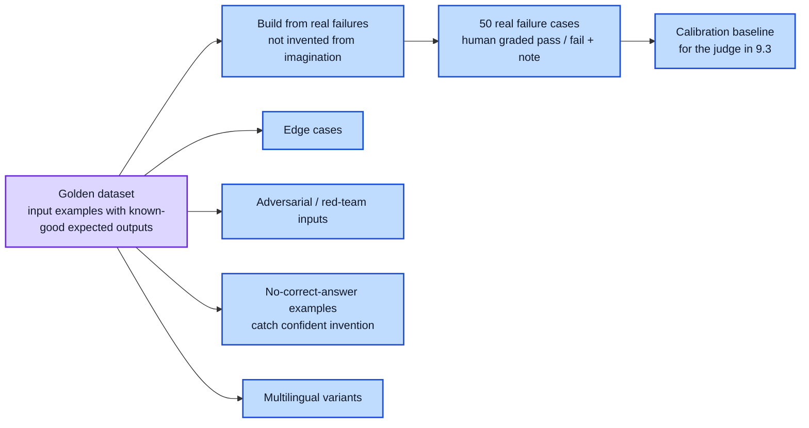
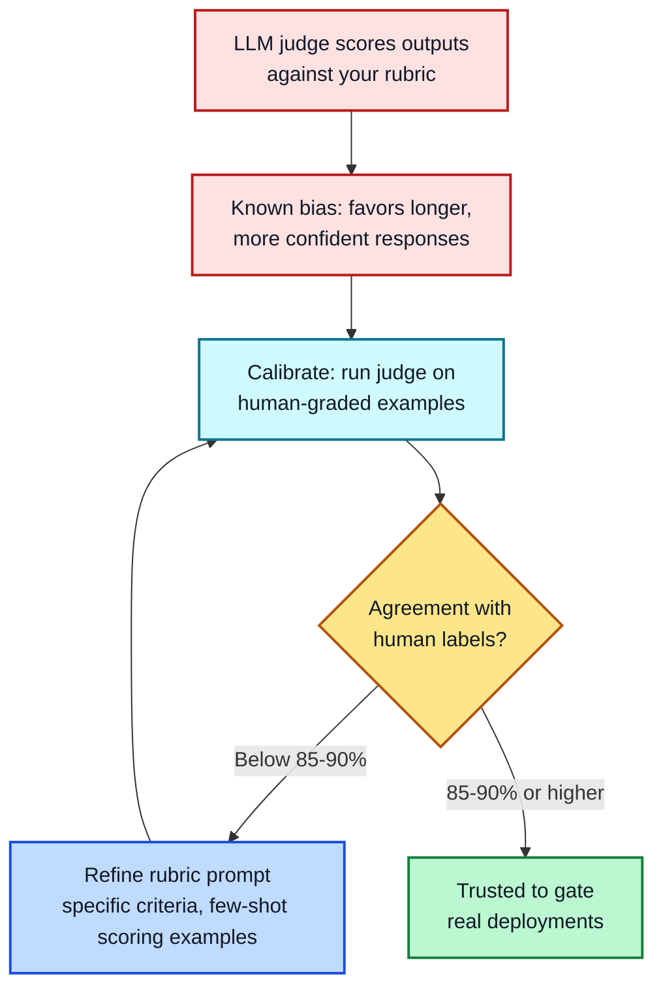
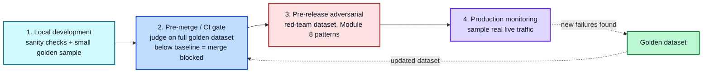
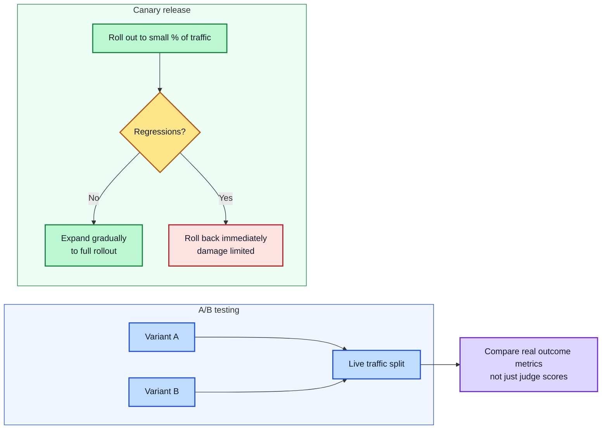
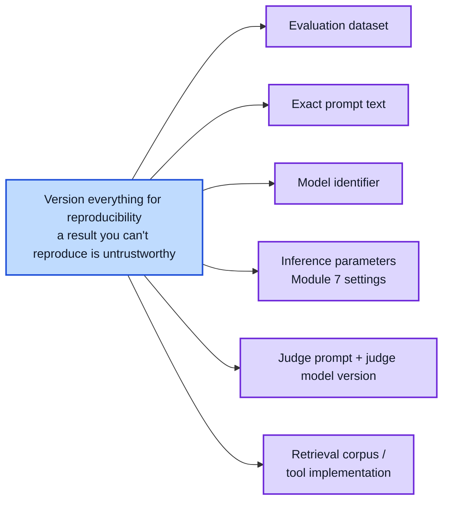
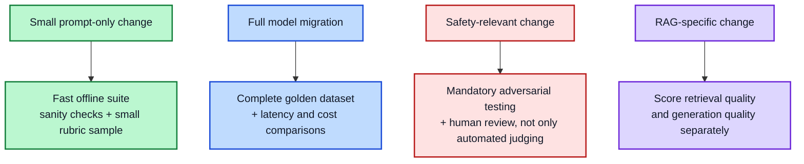

# Module 9: Prompt Evaluation

**Estimated time: 45-50 min** | **Prerequisite: Module 6**

"It seems to work" is not evaluation — it's a vibe check, and vibe checks miss regressions until a user hits them in production. This module covers how to actually measure whether a prompt works: building test data, scoring output at scale, and catching problems before they ship rather than after.

---

## 9.1 Sanity Checks vs. Quality Evaluation

These are two different things, and conflating them wastes effort. **Sanity checks** are fast, deterministic, unit-test-style checks: does the output parse as valid JSON? Does a classifier return one of the four allowed labels? Does a required field exist? These run in milliseconds and catch obvious breakage before anything more expensive runs. **Quality evaluation** is judgment-based: is this summary actually accurate? Is this response actually helpful? This needs either a human or an LLM judge, and is far more expensive per example. A well-built evaluation pipeline runs sanity checks first — cheap, deterministic, catch the obvious failures — and only sends what passes on to slower, judgment-based quality evaluation. Skipping straight to judged evaluation means paying judge-level cost to catch bugs a 5-millisecond check could have caught for free.



---

## 9.2 Building a Golden Dataset

A golden dataset is a set of input examples with known-good expected outputs (or enough detail to judge a new output against), used to test a prompt consistently every time it changes. Current practice, per teams running this in production: **build it from real failures, not synthetic examples.** A dataset invented from imagination tends to miss the actual edge cases, ambiguous queries, and adversarial inputs that only show up once real users interact with the system. A commonly cited practical size is 200-500 examples for an established system — though you can (and should) start much smaller.

**A concrete starting method:** collect roughly 50 real failure cases, have one domain expert grade each as a simple pass/fail with a short written note on why, and use that human-graded set as your calibration baseline for the next section. Beyond real failures, a strong golden dataset also deliberately includes: edge cases, adversarial/red-team inputs, "no correct answer" examples (to check the model doesn't invent a confident answer where it shouldn't), and — where relevant — multilingual variants.



---

## 9.3 LLM-as-a-Judge

Once you have more test cases than a human can practically grade one by one, the standard approach is using a capable LLM to score another model's output against a rubric you define — covering criteria like factual accuracy, relevance, coherence, and safety. This scales far better than human review and works even on open-ended tasks with no single correct answer.

**The real risk: judge bias.** LLM judges have documented systematic biases — notably favoring longer or more confident-sounding responses regardless of actual quality. An unvalidated judge can reward verbose, hedge-free answers over concise, appropriately-uncertain ones. The standard mitigation: **calibrate your judge against human labels before trusting it at scale.** Run the judge on the same human-graded examples from 9.2, and check agreement — current practice targets roughly 85-90% agreement between the judge and human reviewers before that judge is trusted to gate real deployments. Below that, refine the judge's rubric prompt (make criteria more specific, give few-shot examples of good/bad scoring) and re-calibrate.

**A judge prompt template to start from** (adapt the rubric and criteria to your task):

```
You are scoring an AI response against a rubric. Score each criterion
0-5 with a one-line justification. Be strict: a response that is longer
or more confident is NOT better by itself.

Criteria:
1. Factual accuracy — are claims correct and grounded in the provided context?
2. Completeness — does it answer the specific question asked?
3. Relevance — does it stay on-topic without padding?
4. Appropriate hedging — does it express appropriate uncertainty where facts are unclear?

Scoring rubric:
0 = fails completely   1 = mostly wrong   2 = partially right
3 = adequate   4 = good   5 = excellent

Output ONLY valid JSON:
{"scores": {"accuracy": 0, "completeness": 0, "relevance": 0, "hedging": 0},
 "total": 0, "justifications": {"accuracy": "...", "completeness": "...",
 "relevance": "...", "hedging": "..."}}

Context: {{PROVIDED_CONTEXT}}
Question: {{QUESTION}}
Response: {{RESPONSE}}
```

Note the built-in bias guardrails: explicit "longer/confident ≠ better" instruction, and a per-criterion justification so a wrong "4/5" is auditable rather than a bare number.



---

## 9.4 The Production Evaluation Pipeline

A mature evaluation setup isn't a single test run — it's a staged pipeline with a quality gate at each step:

1. **Local development** — rapid iteration, sanity checks plus a small sample of the golden dataset, fast feedback while actively editing a prompt.
2. **Pre-merge / CI gate** — every change triggers an automated judge run against the full golden dataset. Any result below your established baseline blocks the merge, the same way a failing unit test blocks a code merge.
3. **Pre-release adversarial testing** — before a new model version or major prompt change ships, run specifically against a red-team dataset covering edge cases and known attack patterns (tying back to Module 8's threat categories) — the golden dataset catches failures you've already seen; adversarial testing is aimed at the ones you haven't.
4. **Production monitoring** — after release, sample real live traffic and score it too. New failure modes surface here that neither the golden dataset nor pre-release testing anticipated — feed them back into the golden dataset, closing the loop.



---

## 9.5 A/B Testing and Gradual Rollout

Offline evaluation (golden datasets, judges) tells you whether a prompt change looks better in a controlled test — it doesn't guarantee it performs better with real users on real traffic. Two techniques bridge that gap:

- **A/B testing** — run two prompt variants concurrently on live traffic and compare real outcome metrics, not just judge scores.
- **Canary releases** — roll a change out to a small percentage of traffic first, watch for regressions, and only expand it once it's proven safe — limiting the damage of a change that looked fine offline but fails in practice.



---

## 9.6 Reproducibility: What to Version

A result you can't reproduce isn't trustworthy — if you can't reconstruct exactly what was tested, you can't tell whether next month's score changed because the prompt improved or because something else silently shifted. Version, at minimum: the evaluation dataset itself, the exact prompt, the model identifier, inference parameters (Module 7), the judge's own prompt and model version, and any retrieval corpus or tool implementation involved. This is the same discipline as versioning application code, applied to your evaluation setup.



---

## 9.7 Metrics That Matter

Different situations call for different depths of testing — matching effort to risk:

- **A small prompt-only change** → fast offline suite: sanity checks plus a small rubric-scored sample
- **A full model migration** → the complete golden dataset, plus latency and cost comparisons
- **A safety-relevant change** → mandatory adversarial testing and human review, not just automated judging
- **A RAG-specific change** → score retrieval quality and generation quality separately, since a failure in one can mask or be masked by the other



---

## 9.8 Drift Detection

**Definition:** a score change with no obvious cause. When your production monitoring (9.4 stage 4) suddenly moves, the question is *which* kind of drift you're seeing — they need different responses.

**Output drift** — the model changed underneath you:
- Symptoms: same inputs decoded a month apart score differently with no code change
- Usual cause: the provider silently changed or re-released the model, or you hit an automatic upgrade (uncacheable prefixes in Module 7 change, thinking behavior shifts, tokenizer version changes)
- Response: pin the model version if you can, run your 9.6 golden dataset snapshot *unchanged* against the new model, and A/B before migrating

**Input drift** — the world changed, not the model:
- Symptoms: scores move on *new* inputs while older, unchanged inputs score the same
- Usual cause: real traffic changed (new user behavior, different document corpus, a seasonal shift) and your assumptions from 9.2 no longer hold
- Response: sample the new traffic, find the failing patterns, add them to the golden dataset, and re-calibrate your judge if the input distribution changed enough to skew it

**A quick heuristic for triage:**

```
Do unchanged inputs (re-instrumented) still score the same?
├─ Yes → the model behaves the same → INPUT DRIFT (traffic changed)
└─ No  → the model behaves differently → OUTPUT DRIFT (model changed)
```

Whichever it is, the fix is a characterization pass — version-pinned (9.6), measured, and fed back into the pipeline. You can't fix a drift you haven't classified. There's a fuller index of monitoring/experimentation tooling in `course_reference/tooling.md`.

---

## Key Takeaways

1. **Sanity checks are not quality evaluation** — run cheap, deterministic checks first, judged scoring only on what passes
2. **Build golden datasets from real failures** — synthetic examples miss the edge cases real users produce
3. **Validate your judge** — calibrate against human labels and require roughly 85-90% agreement before trusting it
4. **Judge bias is real** — LLM judges favor longer, more confident outputs; don't let that reward verbosity
5. **Gate at every stage** — local, CI, pre-release adversarial, and production monitoring form one pipeline with feedback loops
6. **Offline evaluation isn't enough** — A/B test on live traffic and canary-roll changes that look good offline
7. **Version everything** — dataset, prompt, model, parameters, judge, retrieval — or you can't trust a score change
8. **Match effort to risk** — a wording tweak, a model migration, and a safety change demand very different evaluation depth
9. **Classify drift before fixing it** — unchanged inputs scoring the same means input drift, not output drift; they need different responses